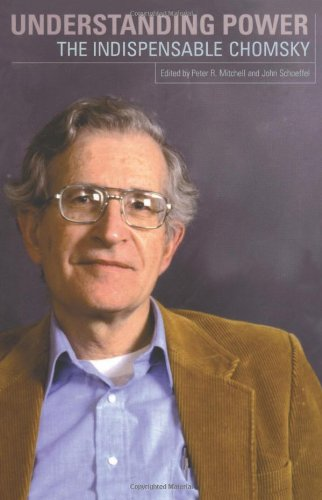
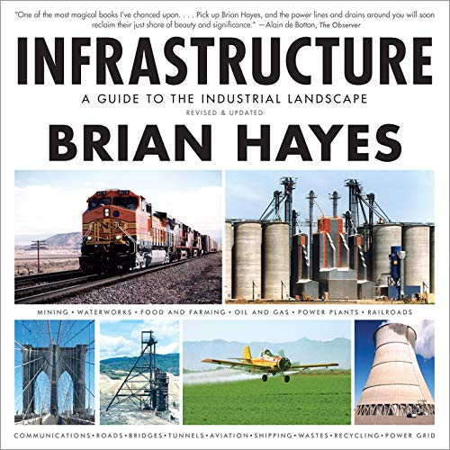
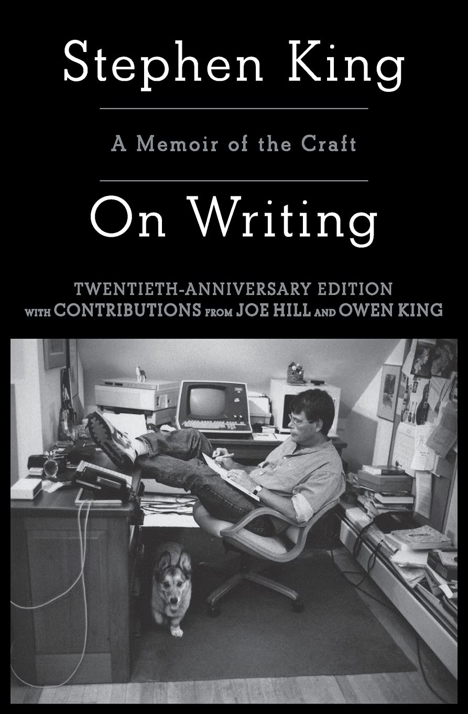
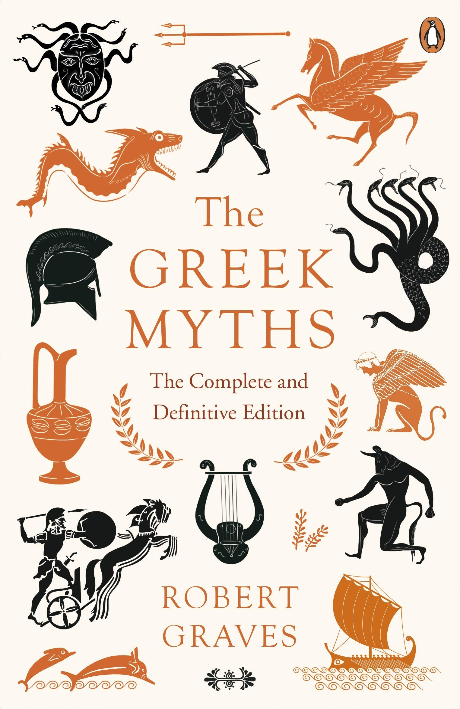
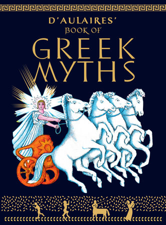
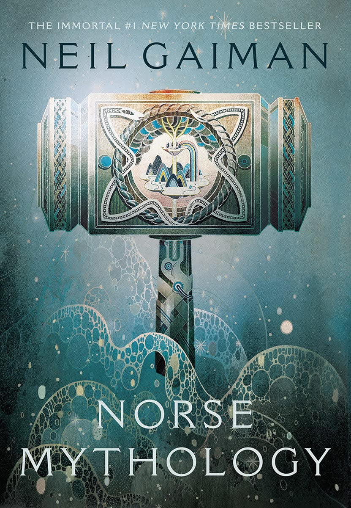
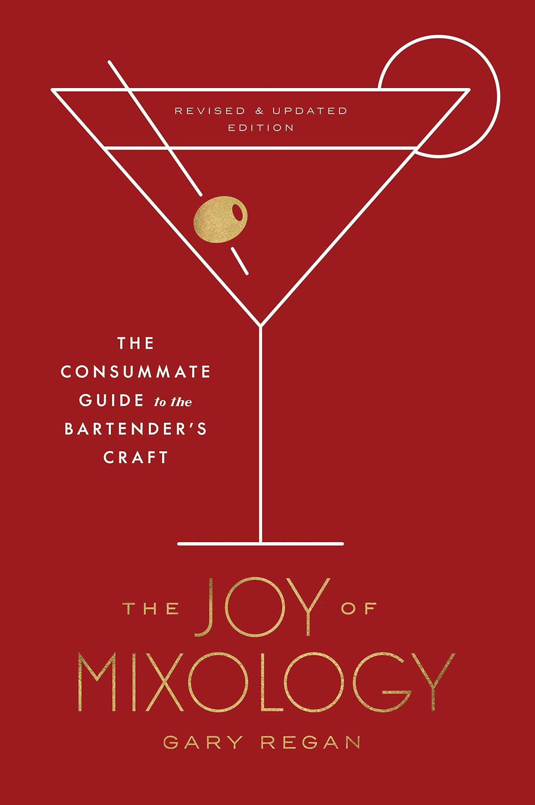
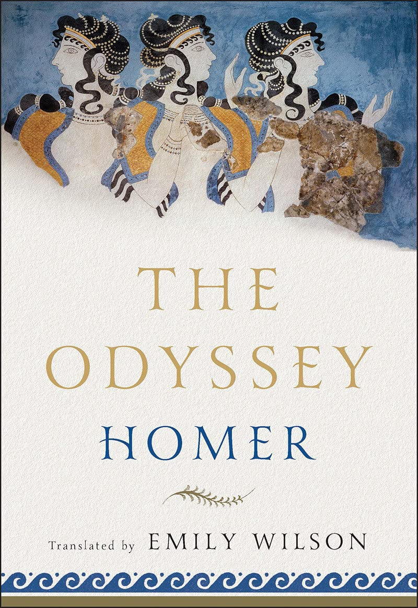
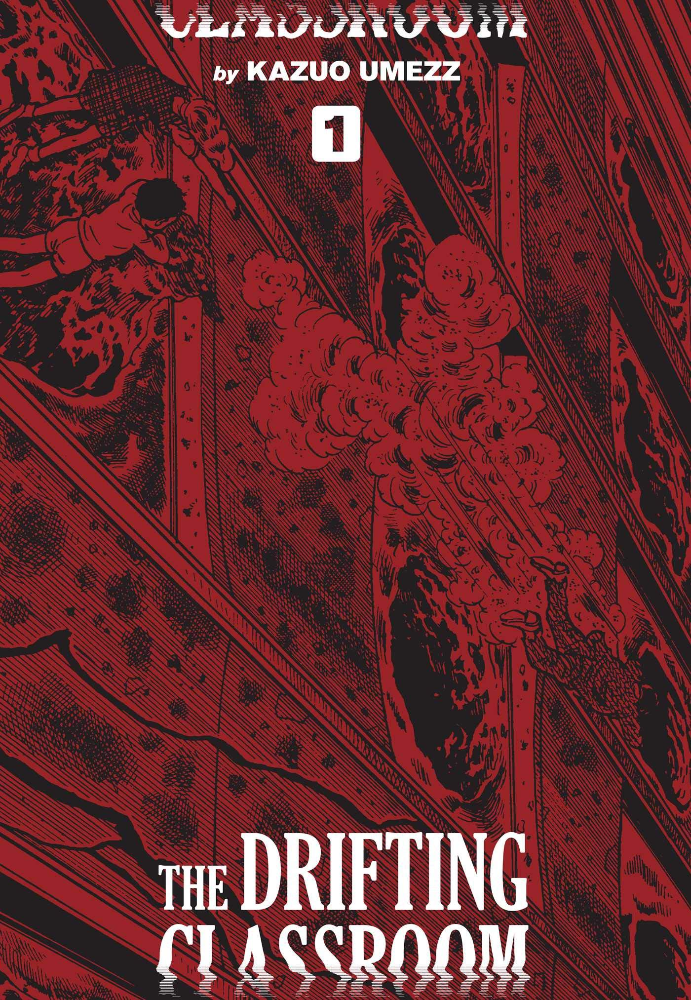
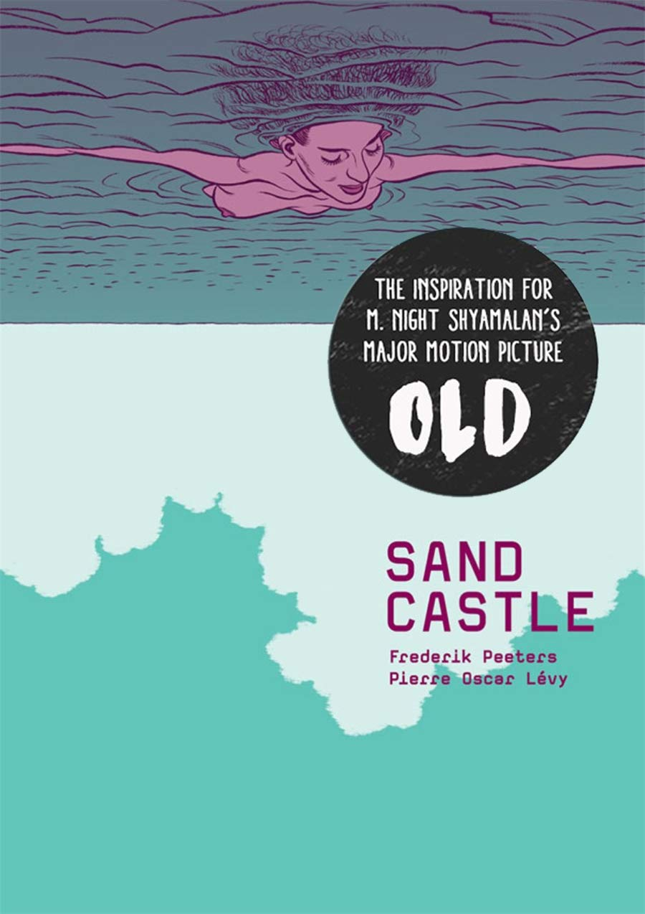

Please don't judge me.

I haven't read many books this year but I've read infinitely more than I did last year.

I used to read during my daily commute... One day, I just stopped commuting and so I stopped reading too.

This summer, I decided to set aside a bit of time every day to read and here we are. Here's each book I read this year in the order that I read them.

#### Understanding Power by Noam Chomsky

Understanding Power is the book that convinced me that I needed to start reading again. It's just a bunch of transcripts taken from Noam Chomsky Q/A sessions, but man, I'm glad that I was convinced to sit down and read through it.

Noam Chomsky has eidetic memory (more commonly known as photographic memory) and so you can ask him about anything and he'll be able to perfectly recall everything he's read and written about the subject. So, even transcripts of his Q/A sessions can be just as informative and important as anything else you've read in your life.

The book covers many important topics relating to "Power" but it mainly focuses on the US, and the many atrocities its leaders have played a part in, across the world.

Reading this book was difficult. It challenged me to reevaluate many of my preconceived notions about how the world works and I'm better for it.

It's also a book that I recommended to many people, and half a year later, not a single person has taken the time to read it...

I probably didn't give them a good pitch for it (maybe this isn't a good pitch either?) but in the new year I'm looking forward to improving my ability to retain information about the books I read and give better pitches for them!

If you decide to read one book I mention here, it should probably be this one, but honestly you would probably have more fun reading this next one.

#### Infrastructure: A Field Guide to the Industrial Landscape by Brian Hayes

Infrastructure: A Field Guide to the Industrial Landscape is exactly what you think it is and it's amazing. It's a book that covers anything that you could consider to be "Infrastructure" (water treatment, electricity, farming, cargo ships, airplanes, mining, etc.) and gives you a broad yet deep understanding of how it all works through clear writing and beautiful photos taken by the author himself.

After reading Infrastructure, I now have a better understanding of all the infrastructure that surrounds me and this knowledge prevents me from taking anything for granted. I now know what others needed to build (and need to maintain) for me to be able to flip a light switch on and off or pour myself a glass of water.

#### On Writing: A Memoir of the Craft by Stephen King

On Writing by Stephen King is half part autobiography and half part a guide to writing. You probably know Stephen King's work and you've probably seen one of the thousands of movie adaptations of his books like It, Carrie or Shawshank Redemption). He is extremely prolific and he's one of my favorite writers so when I heard that he wrote this book on writing, I picked it up right away.

On Writing does not disappoint. He tells the story of his life and his road to becoming the writer he is today. As you would expect, it's a real page turner. Stephen King could write about paint drying and you would be glued to your seat.

Eventually, Stephen starts to give advice to people who want to become better writers. He mostly just says to write what you know and to practice every day? To be fair, I've become a better writer since I started following his advice soooooooooooo he must be onto something.

There's one passage in particular that has been stuck in my brain for a while now and here it is.

He says that "Writing is telephathy."

> "Look- here's a table covered with red cloth. On it is a cage the size of a small fish aquarium. In the cage is a white rabbit with a pink nose and pink-rimmed eyes. […] On its back, clearly marked in blue ink, is the numeral 8. […] The most interesting thing here isn't even the carrot-munching rabbit in the cage, but the number on its back. Not a six, not a four, not nineteen-point-five. It's an eight. This is what we're looking at, and we all see it. I didn't tell you. You didn't ask me. I never opened my mouth and you never opened yours. We're not even in the same year together, let alone the same room… except we are together. We are close. We're having a meeting of the minds. […] We've engaged in an act of telepathy. No mythy-mountain shit; real telepathy."

There's something very personal about writing and reading that makes it worth doing. It was nice to be reminded of that.

#### The Greek Myths: The Complete and Definitive Edition by Robert Graves

I've always been fascinated by Greek mythology but my understanding of it came from the sanitized stories I read in D'Aulaires Book Of Greek Myths and secondhand from the many modern interpretations of the myths I had seen throughout my life.

Prior to reading this book, I had never really taken the time to dive deep into Greek mythology.

I'm glad I did because now I cringe thinking about all the times I said that I prefer Greek mythology to Christianity because it's: "way funner".

I mean, in some ways, it is buuuuuuut also Zeus rapes a lot (they don't really talk about that in d'Aulaires illustrated book for kids)...

If you want to learn about every single Greek myth that exists, then you should read this book. Otherwise, you should stay far far away from it.

#### Norse Mythology by Neil Gaiman

Unlike Greek mythology, we don't have many written records describing Norse mythology as it existed. So, there's not really much we know about Norse mythology.

In his book titled Norse Mythology, Neil Gaiman riffs on what we know about the Norse myths and creates his own retellings of the stories and some completely new ones.

It's OK. I like a lot of Neil Gaiman's work (especially American Gods), his passion for mythology is clear and it shines through most of his work. Unfortunately, I don't think I have as much of an appreciation for Norse mythology as he does and reading this book didn't change that.

#### The Joy of Mixology, Revised and Updated Edition: The Consummate Guide to the Bartender's Craft by Gary Regan

[Cocktails, Cocktails, Cocktails, Cocktails, Cocktails... Cocktails, Everybody!](https://strategineer.com/cocktails/)

My buddy who's a bartender recommended this to me when I expressed interest in learning how to mix cocktails. It's got a bunch of good cocktail recipes and historical context for most of them (if you're into that kind of thing).

Interestingly, in the first few pages, Gary describes bartenders as being "Ganymedes", a young boy (remember this) who is the immortal cupbearer of Olympus in Greek mythology. This comparison is one you would probably avoid after reading Robert Graves's take on Ganymedes.

Robert posits that Ganymedes was a character created by the Greeks/Romans much later on and "retconned" back into the mythology to legitimize their rampant pederasty. Have fun with that information.

#### The Odyssey by Homer (translated by Emily Wilson)

I've never read the Odyssey, and so I chose to read a recent translation of it by Emily Wilson.

It's written in modern English making it easy to read. There's no reason to use archaic English, which apparently is the norm with these kinds of texts, when translating a text that was originally in Greek. It's a poem with the same number of lines as the original which is just plain fun.

It's an interesting text and now I understand why some people decide to spend their entire lives thinking about it.

[I've shared a few of my thoughts on it here](/blog/2021-12-06/#the-odyssey).

#### What's next?
I tried to get into The Eye of the World (the first book of Robert Jordan's popular The Wheel of Time series) but I got about a third of the way through and dropped it. The dread that I feel when reading bullshit fantasy novels seems to be too damn high now.

No matter how well it's written, I feel like I'm wasting my time reading a book like this (I wasn't always like this, I've read all of The Riftwar Cycle by Raymond E. Feist).

There's nothing wrong with fiction, but if I'm going to read fiction I would much rather read something like the Dispossessed by Ursula K. Le Guin which uses a sci-fi world to unpack and explore real world issues.

I'm sorry, you absolute nerds.

Also, I got myself a copy of "The Art of Strategy: A Game Theorist's Guide To Success In Business And Life" on a whim and I'll be starting that before the end of the year. We'll see if it's any good.

I would like to write at least one book review in 2022 (if it goes well, I'll do more). I was planning on trying that this year but, first, I needed to figure out how to take good notes and retain the important parts of my readings first. I've gotten a lot better at that sooooooooooooooooooo ya. You can expect at least one book review next year...

EDIT 2021-12-20:
I neglected to mention the mangas and comic books that I read this year so let's briefly talk about those for posterity.

#### The Drifting Classroom by Kazuo Umezz

Everyone knows about Junji Ito but not many people know about the work of Kazuo Umezz and that's a shame.

This manga falls into one of my preferred manga sub-genres "kids suffering greatly and no one knows why" (Bokurano by Mohiro Kitoh is a great one of these). The story takes place in a classroom that's drifting... If you're a fan of Junji Ito's work like Uzumaki then you should check this one out too.

#### Remina by Junji Ito

Junji Ito is cool. Uzumaki is great. A lot of his other work is just OK. I think Remina is also just OK.

#### Sandcastles by Frederik Peeters and Pierre Oscar Levy

I didn't like Sandcastles. I'm not exactly qualified to critique graphic novels. I'm either too stupid to understand what it's trying to say or it's not trying to say anything at all. Either way, it didn't make me feel anything... Maybe I'm dead inside?
