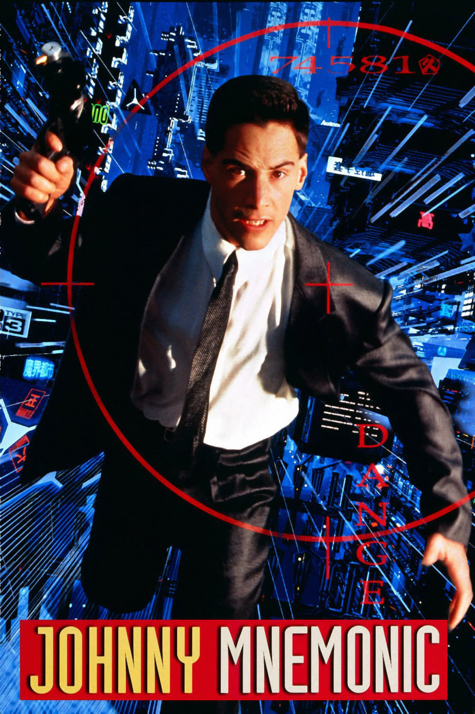
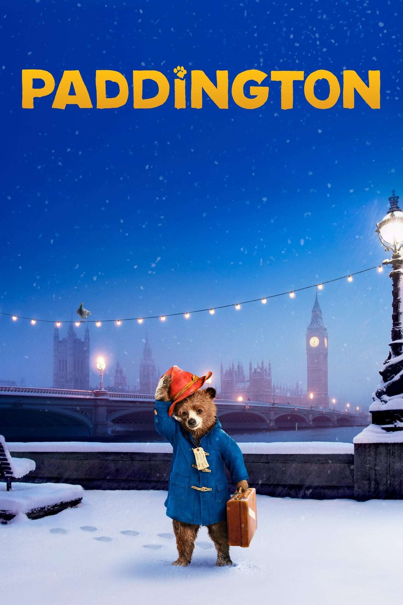
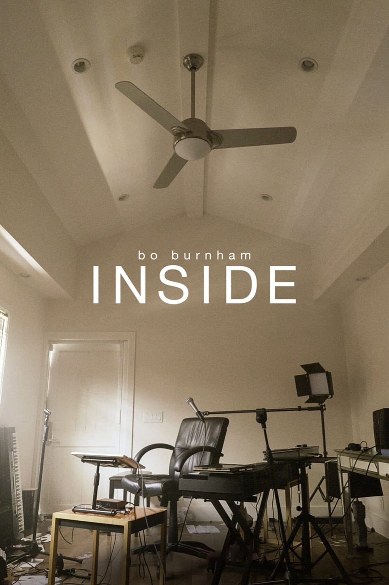
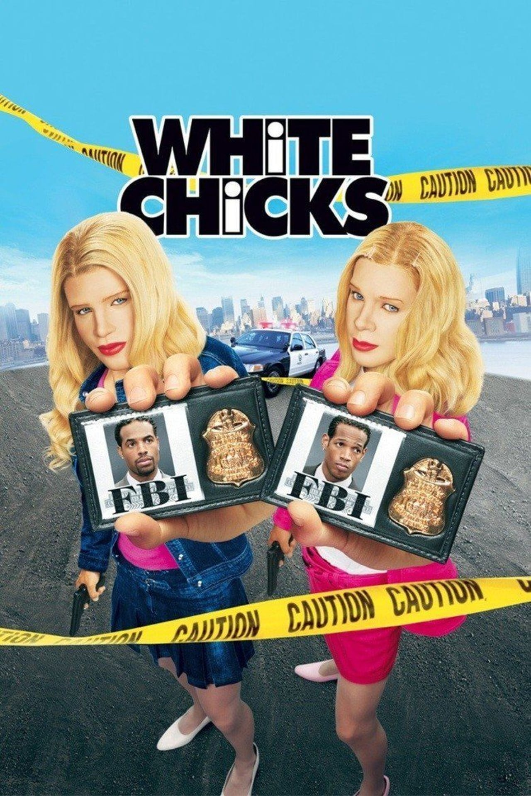
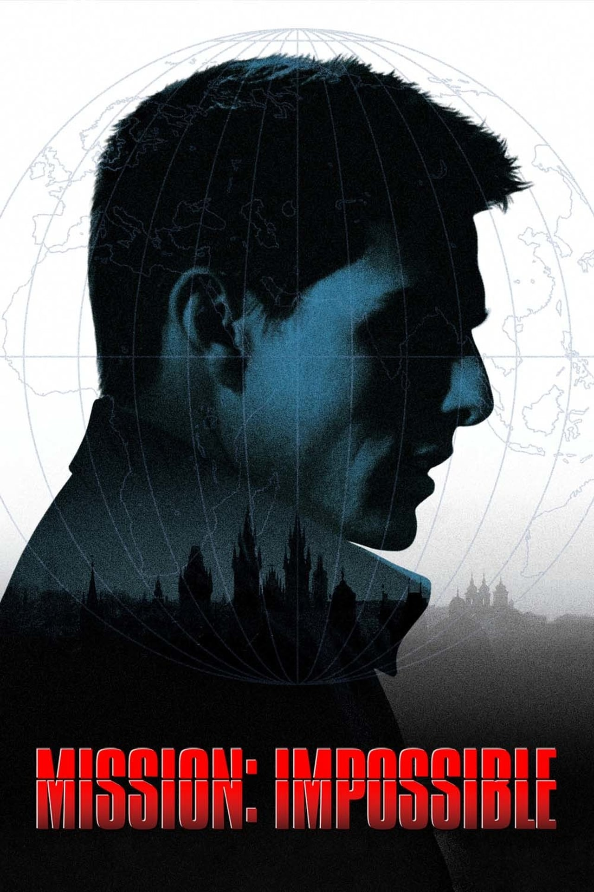
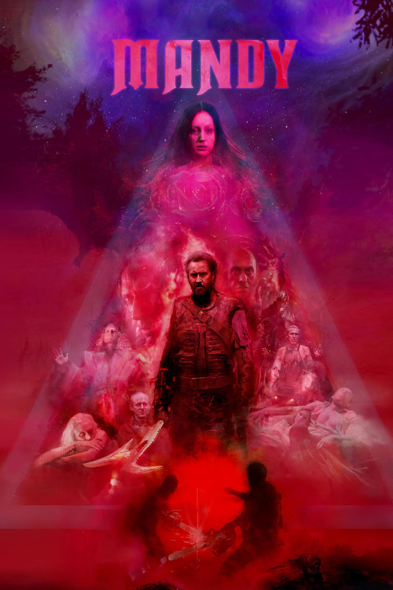
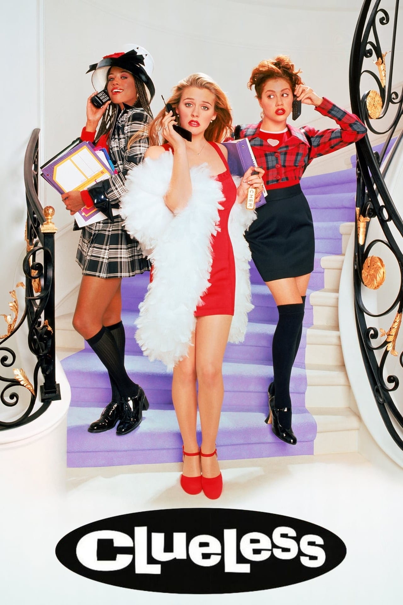
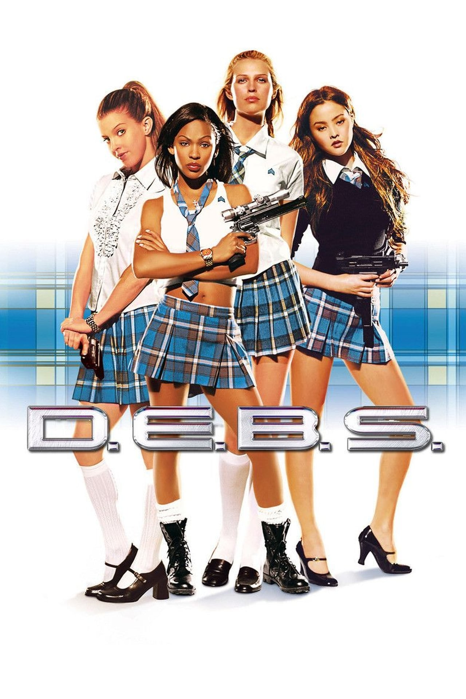
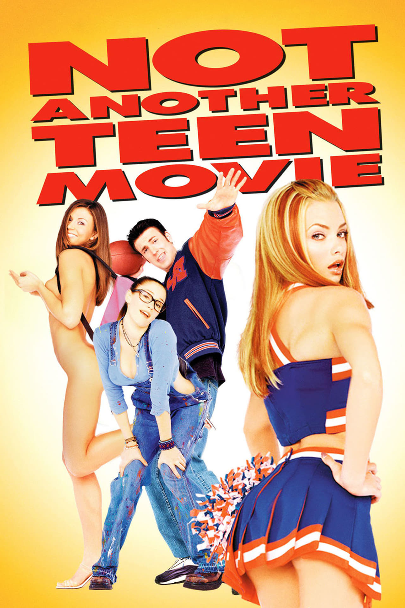
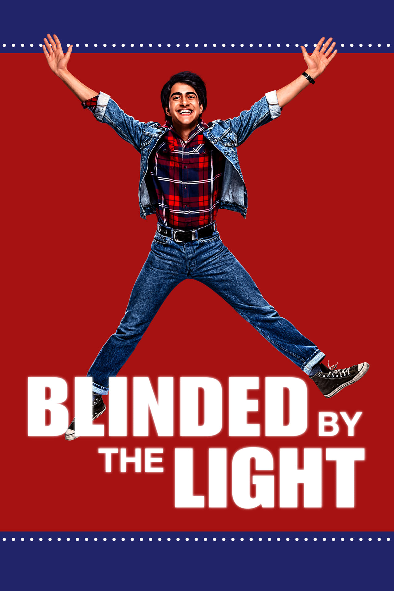

Here's a list of the movies I loved (and hated) in 2021 in categories that describe how I felt about them (within each category, the ordering is irrelevant).

## Movies I loved

Johnny Mnemonic
: Keanu Reeves in a business suit going insane in a dystopian cyberpunk world. Keanu's inability to act and William Gibson's inability to write only added to the charm of this movie.
: The pile of trash that Johnny stands on when making his speech about wanting "room service" near the end of the movie represents the movie itself.
: I was able to use this pile of trash as a stepping stone to introspect on the disillusionment one can feel as a white-collar worker living in a capitalist dystopia.

Paddington
: Paddington is a fluffy bear who leaves the forest after tragedy strikes and goes to London to meet the explorer who taught his family to speak.
: Far from the place he used to call home, he tries desperately to fit in and surround himself with people who love him.
: We are all Paddington and his story is a story of hope that will bring you and your entire family to tears - of sadness but eventually of joy.

Bo Burnham: Inside
: A one man comedy-drama musical filmed and recorded in a single room during the COVID-19 pandemic. You'll laugh, you might cry, but you'll probably cry while you're laughing.
: Big shoutout to the Jeff Bezos Song, that one's a masterpiece.

White Chicks
: Has a movie about two black FBI agents dressing up as white women to solve a kidnapping plot aged well?
: Way more than you would expect.

Another Round (2020)
: Mads Mikkelsen and his coworkers, all high school teachers, drink during the day to keep their blood alcohol percentage at a certain level for "science".
: Hilarity and tragedy in equal amounts ensues.
: Another Round might have convinced me to get into mixing cocktails. I'm not sure if that's a good thing.

Jennifer's Body
: They did this movie real dirty with the way it was marketed.
: I'm glad to know that it's gradually becoming a cult classic after having bombed when it first came out.
: It was "made for girls" but no matter who you are, you're likely to find something to enjoy here (among other things, I enjoyed watching Megan Fox projectile vomit black gunk all over Amanda Seyfried).

Mission Impossible
: Tom Cruise strikes again, he can do no wrong (on the screen).
: I had never watched a Mission Impossible movie before and I'm glad I finally corrected that this year.
: If this is a heist movie then it's my favorite one.

## Movies I hated

Chaos Walking
: Men being unable to hide their thoughts is one of the goofiest ideas I've ever seen in a movie.
: Listening to Tom Holland awkwardly blurt out thoughts like: "Girl, Cute, Lips, Kiss, Girl, Pretty." is perfection.
: They could only afford one scene with an alien. After that, the aliens are never mentioned again despite them being critical to the plot. I'm not sure what happened there.
: I have many questions but my most important one is: how was this made and why?

Mandy
: Produced by our lord and saviour, Elijah Wood, Mandy is a psychedelic horror movie directed by Panos Cosmatos starring Nicolas Cage.
: All of that sounds good on paper but sounding good is about as far as it goes.
: This movie is the definition of style over substance. After watching it, I would hesitate to call it a movie, it's more like a series of nonsensical clips stitched together by a clown on crack.
: Smoking copious amounts of the devil's lettuce might make this movie bearable to watch.
: Keyword: might.

## Great coming-of-age teen comedy movies that I watched

She's the Man
: She's the Man is a retelling of William Shakespeare's play Twelfth Night.
: In She's the Man, Viola's soccer team gets the ax, she asks if the girls can try out to join the boys team. The coach and her boyfriend (soon to be ex) laugh at her.
: Viola's not happy about this so she "becomes the man" and masquerades as her brother Sebastian to play on the boys soccer team at his high school. Her goal is to eventually beat her ex's soccer team and show them that she can be just as good or better than the boys.
: If you're nostalgic for Amanda Bynes doing a great job on the big screen, you've got to watch this. Even if Amanda Bynes never made your PP go bruh when you were a kid, you should probably still watch this.

Clueless
: Apparently, Clueless is a retelling of Jane Austen's 1815 novel Emma.
: A lot of coming-of-age teen comedy films of this era were retellings of classic stories and Clueless is one of the better ones.

D.E.B.S.
: This is an absurd movie about spies secretly being selected through the SAT test and a spy-in-training falling in love with a supervillain.
: It bombed at the box office hard, and I mean haaaaaaaaaard.
: It's not good but watching it was life changing.

Not Another Teen Movie
: I love absurd parody movies when they're done well. This is a great one of those.
: If you are a connoisseur of coming-of-age teen comedies from the 80s and 90s like I am (for some reason) then you'll definitely get a kick out of this one, otherwise I would skip it.

Blinded by the Light
: Inspired by the life of journalist Sarfraz Manzoor. This movie, set in the late 80s, tells the coming-of-age story of Javed, a British Pakistani Muslim teenager whose life is changed after he discovers the music of Bruce Springsteen.
: As someone who has never listened to Bruce Springsteen's music, I was able to discover it alongside Javed over the course of the movie.
: Watching Javed as he tries to follow his dreams of becoming a writer while navigating the expectations of his family in a brutally racist Thatcherite Britain is heartwrenching in the best way.

Annnnnnd that's all folks.

I also watched a dozen or so other movies (not mentioned here) that made me wonder if I died in my sleep and was sent to Hell.

Thankfully, that hasn't happened yet but it's only a matter of time, especially if I keep watching terrible movies.
