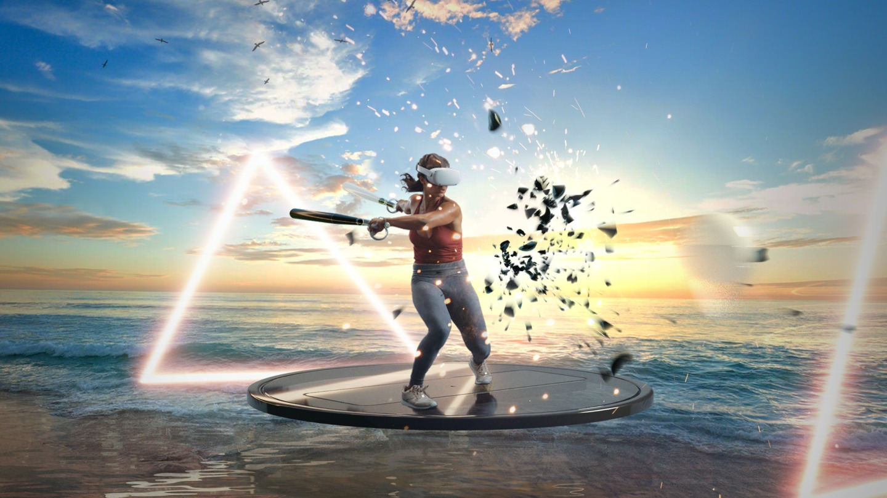
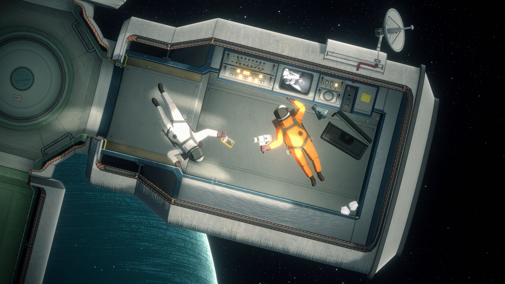
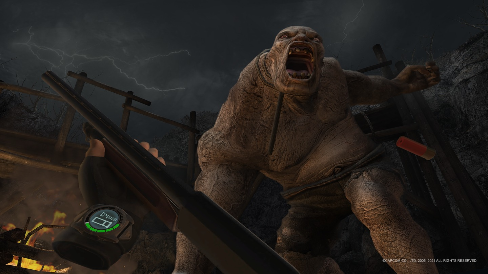
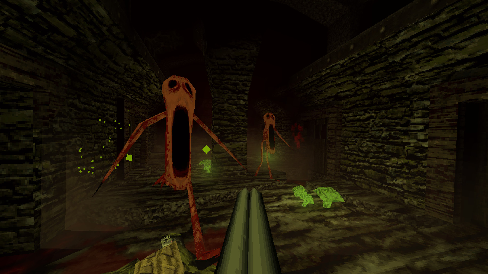
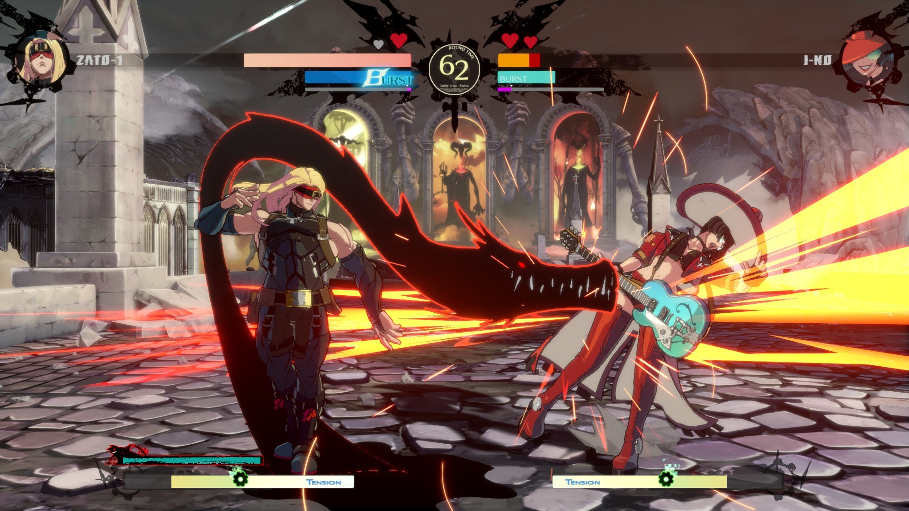
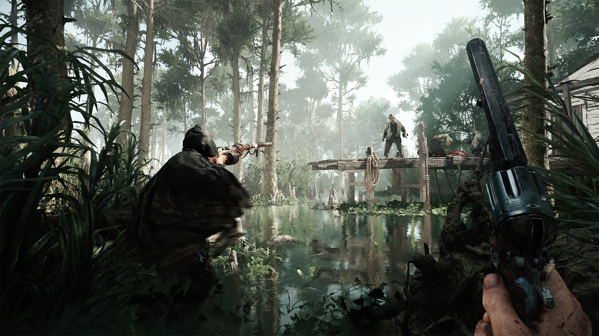
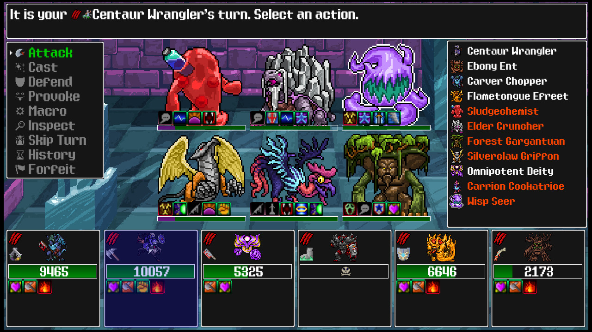
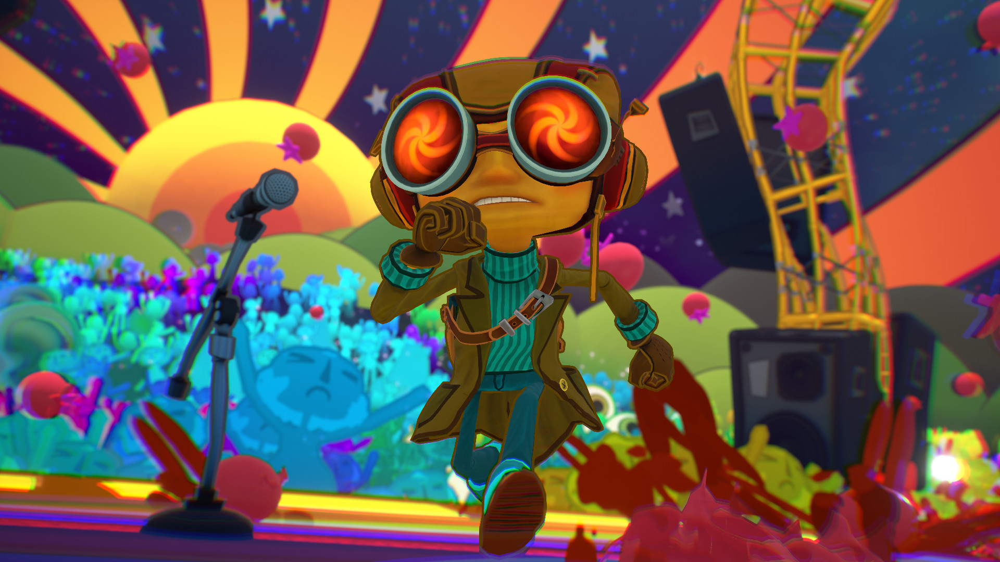

Despite getting sucked into Hunt Showdown in a big way this year, I spent less time playing games than I usually do.

Still, I enjoyed [diving into other worlds with the Oculus Quest 2](/blog/2020-11-07/), [quick resuming games on my Xbox Series X](/blog/2021-03-21/) (purchased in desperation after years of wanting to upgrade my PC but not being able to due to shortages) and playing games on the freshly built monster PC I decided to buy anyway.

Here's a list of games that I enjoyed this year in no particular order.

### Supernatural (Oculus Quest 2)

I've worked in the VR space, I've had 3 different headsets and I've played a lot of VR games. Maybe that adds to my credibility when I say that Supernatural is the best VR workout experience I've had.

Supernatural lets you dance and box to the rhythm of good music in a beautiful landscape with a trainer encouraging you along the way.

Workouts, new ones being published daily, vary in terms of intensity, duration and genre of music allowing you to spend exactly as much time as you have, working out as hard as you like accompanied by the kind of music you're into.

Supernatural isn't doing anything new, it's just doing it way better than any other VR fitness game out there.

You can spend a lot of time sifting through a sea of horrible Beat Saber custom maps and build a few playlists with good music and fitness focused movement. That might give you a similar experience to what you get with Supernatural (especially if you throw in some BoxVR into the mix).

Or, you could just put on your headset and be ready to work out without any prep (if you're playing Supernatural).

What's the catch? Well, Supernatural is a subscription service. You pay them monthly so that they can pay the designers making the daily workouts, the trainers guiding you through them and, especially, the record labels that Supernatural is licensing the good music from.

You might be wondering about the trainers... I like working out alone, usually. But having a trainer encouraging me during my Supernatural workouts helps keep me motivated to keep coming back.

The game is tricking me into thinking that there's someone out there, other than myself, who's invested in my health and personal well-being.

It feels a little weird but it works and I'm fitter than I've ever been. I can't complain.

### It Takes Two (Xbox Series X)

It Takes Two surprised me by being:

- The best 3D platformer I've ever played.
- A uniquely cooperative experience that can be played locally with a friend.
- Challenging enough to keep me invested but accessible enough for my coop partner to not be overwhelmed.

I jump at any chance I get to play a game with another person sitting next to me. I've always enjoyed sharing my passion for games with others and there's no better way of doing that than by playing a game with someone else.

There's very few local cooperative games being made anymore. We're lucky that one as good as It Takes Two was made.

And, I'm very happy to have experienced it with someone I care about.

### Heavenly Bodies (PC)

Heavenly Bodies is, also, a cooperative multiplayer game.

In Heavenly Bodies, you play as an astronaut in (you guessed it!) space. You, and a friend, are thrust into various missions where you have to do astronauty things like adjust solar panels, mine asteroids and repair satellites.

What makes this interesting is that you can't control your character directly, but you do have some limited control over their "Heavenly Body".

You use each analog stick to move your astronaut's arms around, you use the triggers to grab onto walls or hold onto objects and you can use the bumpers to bend your knees closer to your body.

That's it.

Remember you're in space, there's no friction. So you if you start gaining momentum in a certain direction, you're going to keep moving in that direction unless you grab onto something. At least that's the case when playing on the Newtonian difficulty, other difficulty levels make things less "realistic" but more accessible.

Controlling your astronaut is difficult but as you play, you gradually gain more familiarity with the initially awkward control scheme and eventually it becomes second nature.

Each mission requires you to complete increasingly challenging tasks encouraging you to gain mastery over the way you control your astronaut.

There's beauty in a game like Heavenly Bodies that gradually reveals itself to you as you become more familiar with it. I really love easy to learn yet hard to master games like this. I liked this one so much that I [chose to play it as my first speedrunning game](https://youtu.be/AIONEtDqJVg).

Also, the music is very "spacey" and meditative. Sometimes you just let go of whatever you're holding onto and float.

Immersing yourself in the atmosphere, or lack of it.

### Resident Evil 4 VR (Oculus Quest 2)

Resident Evil 4 was released on the GameCube on January 11th, 2005.

Why is a version of it appearing here, in the year of our Lord 2021?

Well, VR is a game changer.

Think about everything in Resident Evil 4.

Swinging your knife at zombies (AAAAAAACTUUUUUUUAAAAAAAAAAALLLY they aren't zombies). Chucking grenades at them. Fending back waves of them in a house with barricaded windows. Taking out Nessie on a fishing boat. Escorting the President's daughter to safety.

Now, imagine doing all that and more in VR.

It's amazing and it's something you have to experience for yourself.

It's not all sunshine and rainbows though. I haven't personally had this problem myself, for obvious reasons, but if you have breasts of a certain size you will end up smacking them repeatedly every time you grab your knife (which is all the time).

If that's the case, you might want to stay away from Resident Evil 4 VR until they implement a patch allowing you to increase the size of Leon's breasts to your heart's desire.

### GarticPhone (PC)

What is GarticPhone?

You and your friends write sentences. Then everyone gets a sentence, written by someone else, and has to draw whatever that sentence is describing. Then everyone gets a drawing and has to write a sentence that describes the drawing they're given.

This continues until everyone has participated in each album of sentences/drawings.

This is [a digital version of the classic children's game of telephone](https://en.wikipedia.org/wiki/Chinese_whispers).

When everything is done, you all look at each of the albums together and laugh harder then you've ever laughed in your entire lives.

### DUSK (PC)

Dusk was an effective gateway drug leading me into the world of modern boomer shooters. I have a lot of nostalgia for playing Doom when I was a kid, that might be why I enjoyed playing Dusk so much this year.

It is a "video game ass video game".

In first person, you run and jump around environments shooting "demons" (?), finding secret ammo caches along the way so you can keep firing your favorite weapons.

Taken at face value, maybe that doesn't sound interesting. But the core gameplay loop feels really great.

But what makes the whole experience worthwhile is the level design.

In Dusk, you'll go on a journey through a wide variety of environments filled with enemies. These levels provide entertainment for your eyes and food for your brain as they force you to use all of the tools at your disposal to survive.

I can't wait to see what tomorrow will bring.

### Guilty Gear Strive (PC)

Guilty Gear Strive is a good fighting game, and the only one I've gotten "seriously" into in my entire life. After 115 hours playing it, I feel comfortable saying that. I've stopped playing it now because:

1. The game's online code is brittle (actually playing the game against other players all across the world feels great but getting there is a challenge and takes more time than it needs to).
2. More importantly, even using a Hit Box controller, it's physically painful for me to play fighting games. I don't necessarily feel it right away, but a day later, my hands are wrecked and I feel like garbage.

I like the idea of playing fighting games more than I do actually playing them. If you're in good health then Guilty Gear Strive is a game that you might actually enjoy playing, whether or not you're an experienced fighting game player.

### Hunt Showdown (PC)

I feel a mix of shame and pride about spending 200 hours playing Hunt Showdown this year. [Hunt is the gift that keeps on giving and I've written about it a few times](/blog/2020-09-04/). Described like a drug by many, it contains more [Skinner boxes](https://en.wikipedia.org/wiki/Operant_conditioning_chamber) than I've ever seen in a video game.

I tell myself that I keep coming back for the deep, strategic action gameplay but maybe, me and everyone I play with are incredibly addicted to the rewards we receive, or lack thereof, whenever we press a button.

I'm done with Hunt Showdown for now but I'm glad to have stuck with a game for this long.

## Runner Ups

### Siralim Ultimate (PC)

Siralim Ultimate is what you get when you combine the creature gathering of Pokemon with the RPG battle system of Final Fantasy.

It would be my GOTY hands down if not for the core gameplay loop consisting of moving your character around a map collecting garbage until you run into a group of enemies.

It's a meaningless waste of time.

As someone with [RSIs](/blog/2020-10-11/), I don't have much room in my life for games that ask you to push buttons for no reason.

Ignoring that, the [game's amazing as I've previously discussed](/blog/2021-11-29/).

### Psychonauts 2 (PC)

I won't be able to finish Psychonauts 2 before the end of the year, and that's the only reason why it's here and not in the main list.

I've played a few hours Psychonauts 2 and I'm amazed at how good it is given how mediocre Double Fine's games have been these past two decades or so.

The combat, the platforming, the art and the story all work perfectly and I'm excited to see how it all pans out.

---

And that's all folks. I'll see you on the other side.
