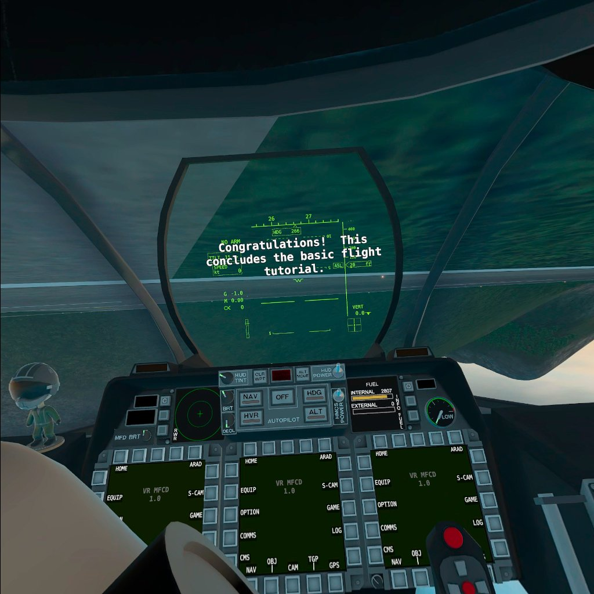
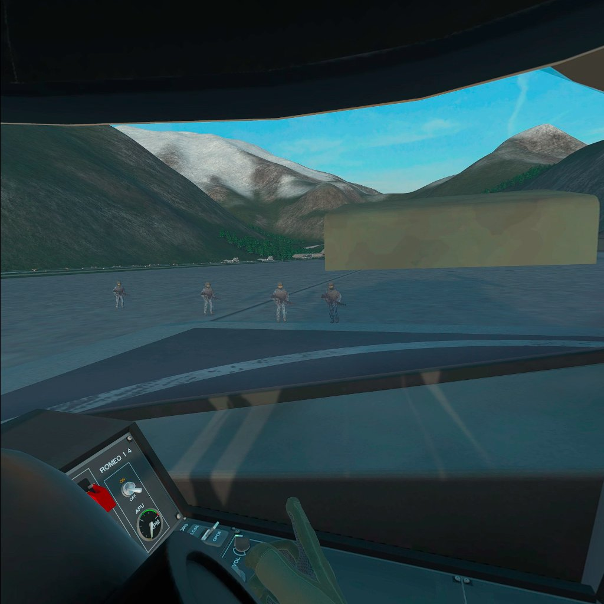
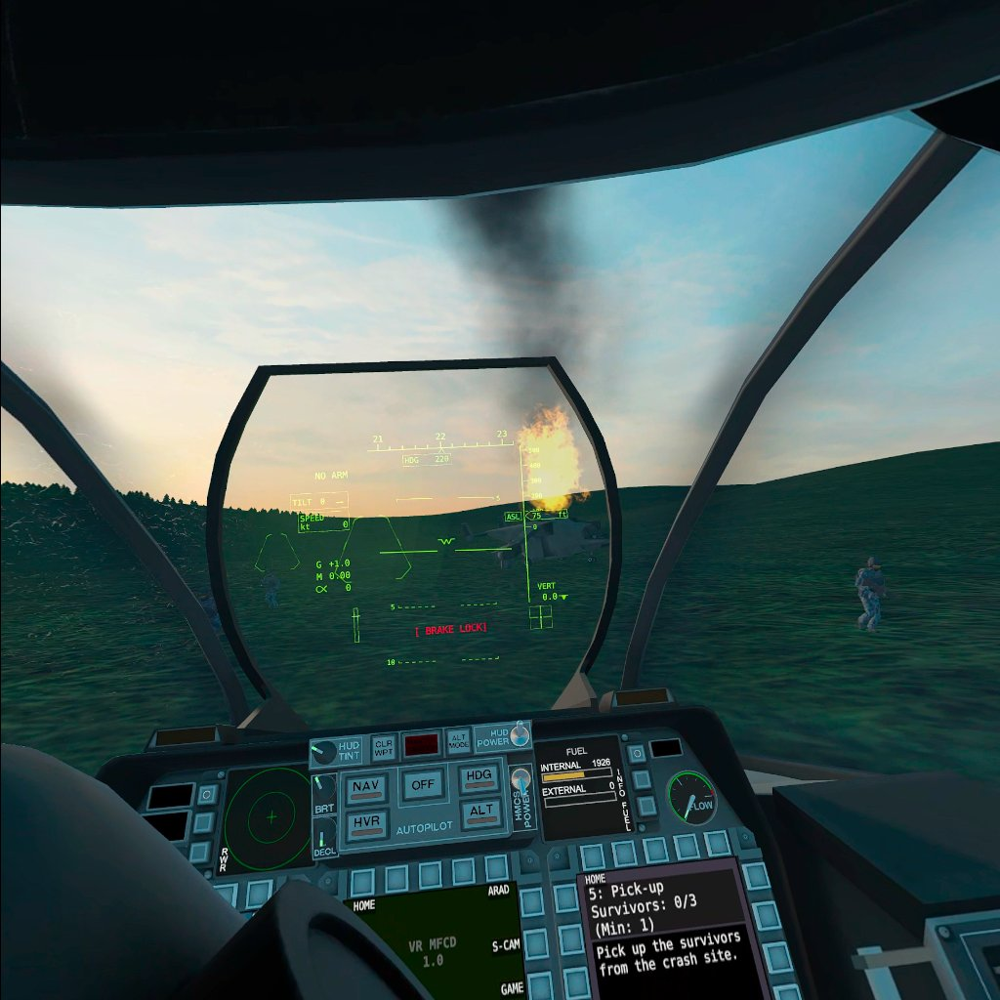

 _Perfect Landing!_

I played a few hours of VTOL VR today (streaming the Steam version to my Quest 2 using Virtual Desktop).

I've never been super excited about planes and doing bombing runs on tiny white dots (collateral damage anyone?) bbuUuUuuuut I had a ton of fun. Maybe [I just like roleplaying as a terrible person](/reviews/2017-09-25/)?

In VTOL VR, you're a pilot of a fully-interactable yet simplified VTOL jet. The cockpit you're in has a ton of fully functioning buttons, levers and joysticks that you use to pilot the jet.

 _Your hearse has arrived, let's get you guys to the front line ASAP!_

I was fortunate enough to have been able to experience flying, and dying horribly, in a flight simulator before (the ones that pilots use to practice the basics before going into the air) and VTOL VR reminded me of that experience.

Given the difference in cost (I don't have a few million dollars to spend on buying a flight simulator), I'll forgive VTOL VR for being unable to physically teleport me into the cockpit of an actual jet.

 _What happened to Jeff?_

In some ways, VTOL VR was actually more immersive but to be fair I was in a pretty old 747 simulator so the tech was a little dated.

There's even [some mad lad speedrunning the game](https://www.speedrun.com/vtol_vr/levels) and it's as crazy as I expected it to be.

After a little under two hours, I was starting to feel a bit sick but that's not unusual for me. I've never fully acclimated to being in VR, especially in games where you're moving around a lot.

I'm hoping I'll be able to convince someone to try out the newly added multiplayer (coop and pvp) with me... Fingers crossed and bombs away.
