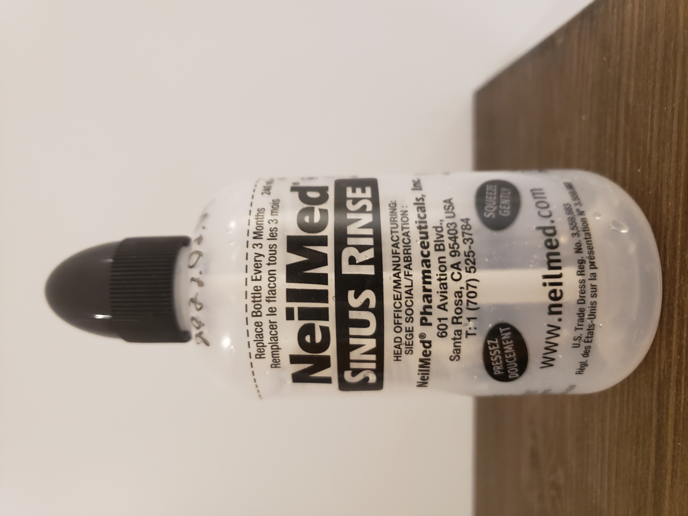
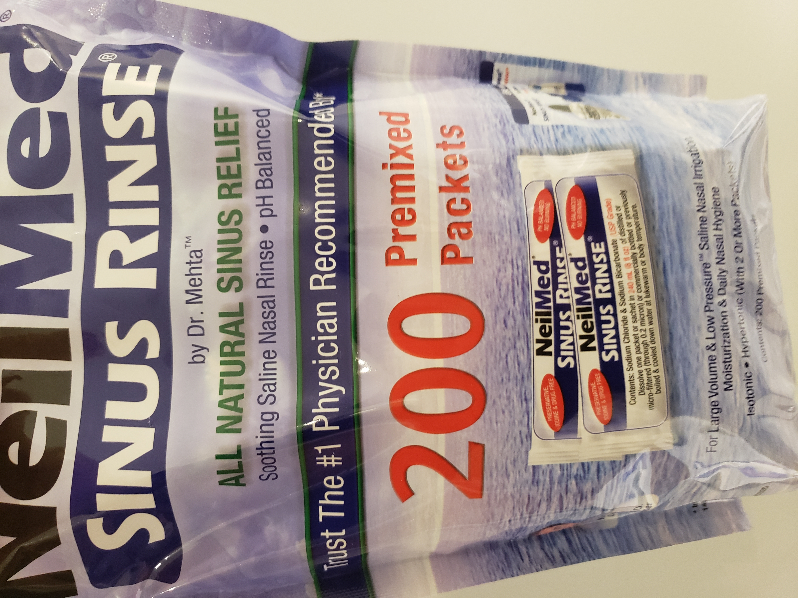

I've suffered from seasonal allergies and dust mite allergies (and cats make me want to die) most of my life. I wasn't brought to an allergy doctor when I was a kid and so I just learned how to deal with it.

But my symptoms worsened over time, making it impossible for me to ignore them any longer. Eventually, I went to get help.

How does one treat allergies?

I'm not a doctor but this is what I know.

Seasonal allergies can be treated through allergen immunotherapy which involves regularly getting injections containing small quantities of the allergens you're allergic too. This helps your body build an immunity to these allergens.

This process takes 3-5 years and its effectiveness is not 100%. I would really hate myself for going through all that work only for my allergies to come back to haunt me again later on in life.

No thank you (at least for now).

You can also buy [antihistamines](https://en.wikipedia.org/wiki/Antihistamine) over the counter in Canada without a prescription. They provide temporary symptom relief for some people but they don't do much for me.

When you've got allergies as bad as mine you need to use something with a little more kick (but with greater power comes greater side-effects), I use a [corticosteroid nasal spray](https://en.wikipedia.org/wiki/Corticosteroid) to relieve my symptoms.

I would rather not have to take medication but I don't really have a choice. I only use the spray during the seasonal periods where I really need it.

But this year, my [dust mite](https://en.wikipedia.org/wiki/House_dust_mite) allergies are the worst they've ever been and I'm suffering more than ever before because of them.

I was recommended to try [nasal irrigation](https://en.wikipedia.org/wiki/Nasal_irrigation) (also referred to as nasal douching) by a friend to help reduce my symptoms. Hopefully, that'll keep me comfortable until I can get a referral for an allergy doctor from my GP.

Doctors are a little busier than usual these days. I wonder why?

Before you start running in the opposite direction, let me tell you that nasal irrigation is legit (this is a meta-analysis study that you can read yourself by going to your nearest _science hub_).[^1] You should do an investigation for yourself, always be skeptical!

It's very simple. You need:

- Sterilised water (distilled or previously boiled then cooled down to avoid letting any brain-eating amoebas into your gooey candy shop).
- Some extra ingredients (we'll get to that later).

You dissolve the dry ingredients in the water, mixing it well.

Finally, you douche the solution gently up your nose with a bottle like this. Half of the bottle into each nostril while you're bending over the sink.

That's it. The water goes into one nostril and comes out the other.

It's a little awkward and it can get a little messy but the symptom relief it provides is surprising.

My dust mite allergies are at their worst in the winter. For an hour or two after I wake up, my nose is completely blocked and I feel like absolute garbage.

But, if I douche right after I wake up, it clears out all the mucus and allergens from my nasal cavity and allows me to breathe properly within a few minutes.

It's amazing...

So what are the secret ingredients?

Let's look at the packaging of the nasal irrigation product I was given as a gift and let's see if we can figure that out.

 _"All natural", uhhhhhh I hate this._

If you zoom in real hard, you'll notice the following ingredients: sodium chloride and sodium bicarbonate.

What's that? Sodium chloride is more commonly known as salt, and sodium bicarbonate is also known as baking soda in North America (bicarbonate of soda in the UK and, apparently, Natron in a lot of other European countries).

These aren't exactly the hardest to find ingredients.

It seems like using table salt and baking soda straight off the shelf to make my own saline solution "should" be fine (I will be verifying this with my doctor) despite table salt not being 100% sodium chloride.

 _A genius who figured out how to sell overpriced salt and baking soda in tiny little packets._

If you've got serious seasonal allergies like I do then and you've never nasal douched before, you might want to try it.

[^1]: Bastier, P.-L.; Lechot, A.; Bordenave, L.; Durand, M.; de Gabory, L. (2015). Nasal irrigation: From empiricism to evidence-based medicine. A review. European Annals of Otorhinolaryngology, Head and Neck Diseases, (), S1879729615001003–. doi:10.1016/j.anorl.2015.08.001
