> The following text contains spoilers for the movie Turbo Kid (2015), reader discretion is advised.

Let's get into a relatively quick but complete summary of the plot of Turbo Kid before I dive into some of my thoughts.

[Feel free to skip ahead if you've recently watched the movie](#thoughts).

# A quick summary

The story takes place in an alternate reality of 1997. Many years ago, humanity lost a war against the robots they created which led to the destruction of civilization.

We follow the Kid, a young man with a fascination for toys and comic books from the pre-apocalypse world, who's struggling to survive on his own in the wasteland, especially due to a lack of clean water.

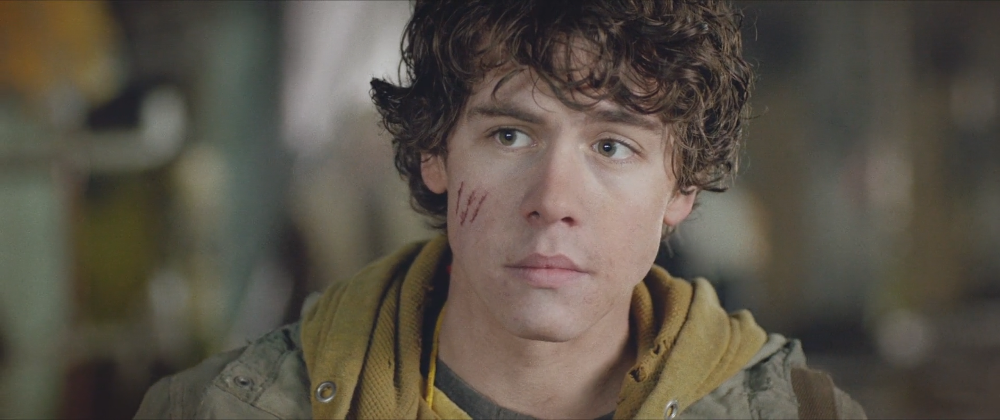
_The Kid_

After bartering for some water at the local bar, the Kid runs into a colourful and carefree woman named Apple.

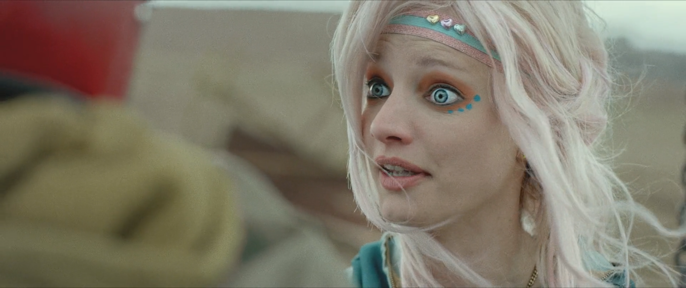
_Apple_

Her eagerness to get to know him scares him and he runs away from her as soon as she turns her back.

To the Kid's dismay, Apple had slapped a tracking device on him which allows her to find his secret hideout.

Feeling as though he doesn't have a choice, the Kid and Apple go scavenging together in the wasteland and slowly become friends.

Once the pair let their guard down, a manhunter captures Apple. A chase ensues as the manhunter attempts to capture the Kid.

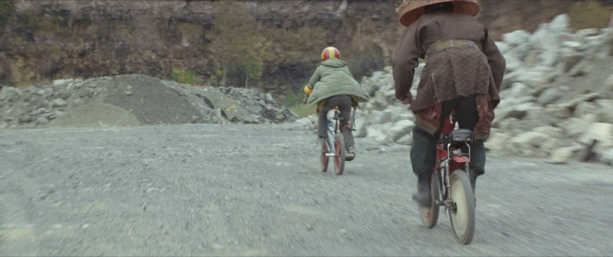
_The Chase_

The Kid escapes his pursuer by falling into the hatch of a derelict human aircraft. Within it, he finds a suit of armor and power glove used by human soldiers during the war as well as the propaganda comic book character Turbo Rider that the Kid is so infatuated with.

He puts on the armor, exits the vehicle and blows his pursuer into chunks using the power glove. The Kid then sets out to find his friend.

He finds Apple, as well as local badass and newly left armless Frederick the Arm Wrestler, trapped in an empty pool turned gladiator arena by the local water baron Zeus (who also happens to be responsible for killing the Kid's parents).

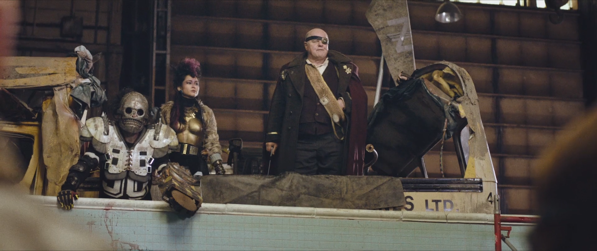
_Zeus and his henchmen_

Zeus reveals that he's been extracting water from blended up human remains. A fight ensues leading to Apple being shot in the chest and our heroes escaping from the pit.

The Kid wakes up from being knocked out and discovers Apple safe beside him, her chest wound revealing damaged circuitry.

He's caught by surprise but quickly accepts her and learns that Apple is a "friendship unit" robot and was built for the sole purpose of being someone's friend (explaining a lot of her past behavior and personality quirks).

They go on a journey to a nearby robot cemetery (a big pit filled with dead robots) to find a replacement for Apple's damaged bioelectric transmitter in an attempt to keep her alive.

They arrive to find Zeus's henchman Skeletron waiting for them.

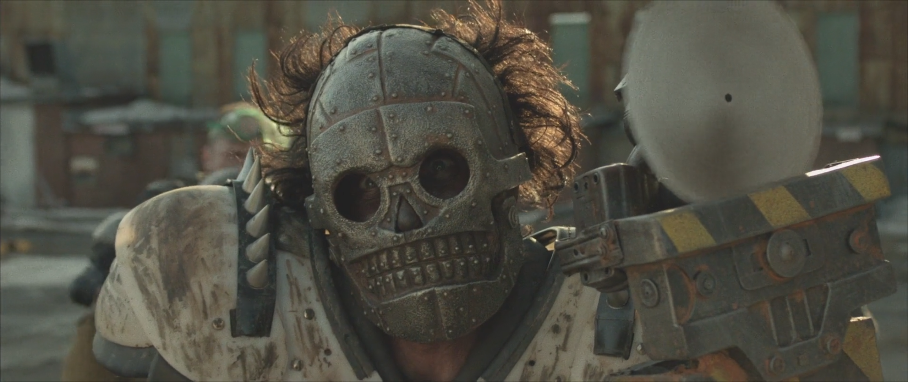
_Skeletron_

A fight ensues, Apple is decapitated by Skeletron's saw blade projectile and the Kid is kicked down into the pit with Apple's head in his hands.

Skeletron walks away from the pit assuming that the Kid and Apple are dead (or soon will be).

The Kid wakes up, tapes Apple's head onto another robot's body and then passes out.

Coincidentally, Frederick happens to be in the same robot cemetery looking for a replacement arm and so is able to rescue the Kid.

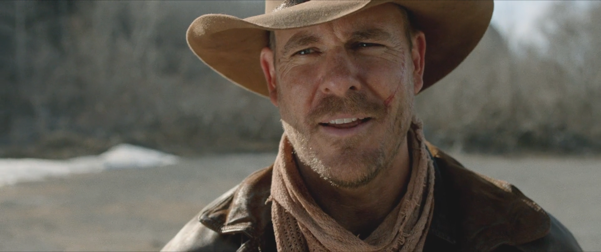

Having both been wronged by Zeus, the Kid and Frederick set out for one final battle with the tyrant.

They find themselves in a big pit with Zeus, Skeletron and all his minions opposing them.

A gory fight ensues as the Kid and Frederick tear into Zeus's minions, slicing and dicing them.

Zeus's female bodyguard, the only other female character other than the Kid's mom (and Apple?) attacks the Kid and he doesn't defend himself.

As she pushes down on his neck with her foot, Apple, with her new body, comes riding in on a bike with a unicorn statue mounted on the handlebars.

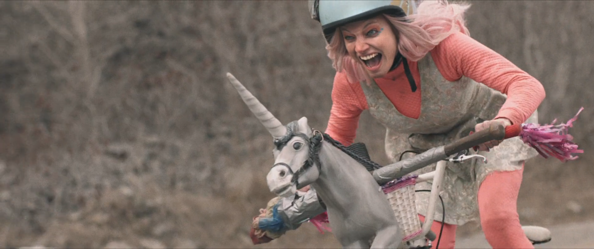
_Apple to the rescue_

Apple rams into the nameless bodyguard, plunging the unicorn into her chest and saving the Kid.

Zeus, tired of playing games, takes his gun and shoots Frederick, Apple and the Kid.

The Kid gets up and reveals that his cherished View-Master reels container deflected the bullet.

The Kid fires his power glove at Zeus who remains in one piece despite everyone else being blown up into chunks by the weapon.

Zeus gets up and is revealed to be a robot, a "corporate companion unit", who killed his master and took his place, subjugating the local people for profit as his programming compelled him to do.

Zeus fires a laser beam out of his mouth at the Kid, in response, the Kid blows up the bomb that Frederick had brought with them at Zeus's feet and Apple jumps in front of the Kid, protecting him from the subsequent explosion.

As the explosion reveals a fresh water source underground, Apple passes away in the Kid's arms from damage sustained in the blast.

Finally, Frederic and the Kid say their goodbyes.

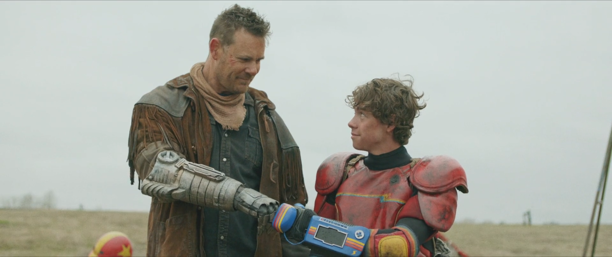

The Kid bikes away from Apple's grave and sets out to explore the wasteland further than he's ever been willing to go before.

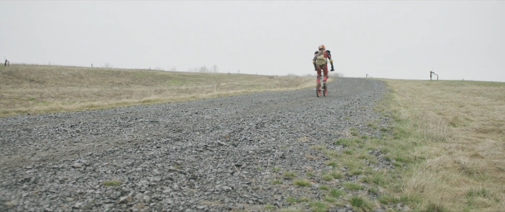

# Thoughts

## Aesthetics

Aesthetically, it's hard for me to find something I don't like in this movie. I love kid/BMX-like bikes used as everyone's main mode of transportation (we even get an amazing bike versus bike chase scene). I love the post-apocalyptic costumes being stupid but also stylish and very Quebecois (a lot more hockey equipment than you would expect to see under normal post-apocalyptic circumstances). I love the extensive use of practical effects for all the blood and guts (reminding me a lot of The Thing). I love the simple scenery that shifts between empty gravel roads, gigantic water-filled quarries and abandoned factories. Every frame of the movie is distinctly "Turbo Kid" and I love it.

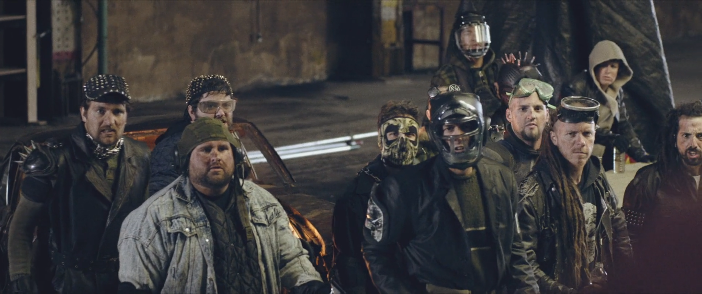
_Zeus's minions (with great costumes)_

## A late coming-of-age story

At the start of the story, the Kid is a young man who spends most of his time isolated and alone, playing with toys and reading children's comic books. He leaves his hideout when he needs to, to scavenge for food or trade with the local barkeep, but otherwise he stays at home by himself surrounded by relics from the past. It seems clear to me that his deep attachment to these relics is intertwined with the memory of his parents who were killed by Zeus when he was a young boy.

Turbo Kid is a coming-of-age story about a developmentally challenged young man who never grew up properly due to the early death of his parents and the harsh post-apocalyptic world he grew up in, or failed to grow up in. By building relationships with Apple and Frederick throughout the story, the Kid becomes more connected to the world around him, and the people in it, and can finally let go of his past trauma and begin looking toward the future.

This can be seen in the moment during the final battle when the Kid takes his View-Master reels container out of his chest pocket (that had protected him from a bullet) and throws it away, acknowledging that his childhood and his parents were important and their memory is part of what kept him alive all these years, but it was now time to let go of the past and move on.

It hit me like a ton of bricks when the Kid was separated from Apple for the first time and said: "I don't want to be alone again".

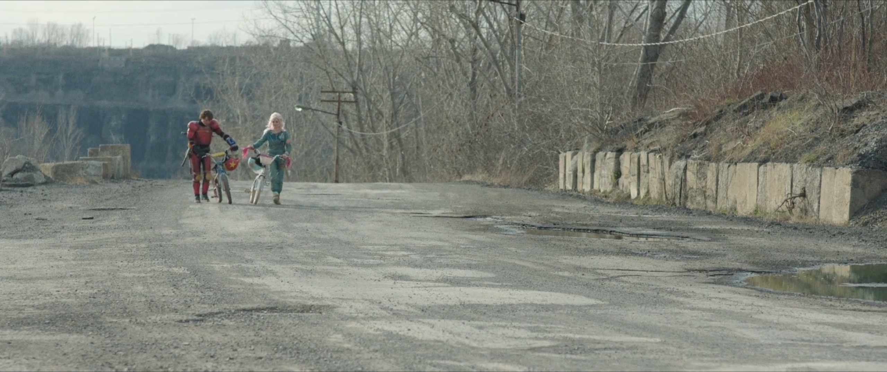

Me too buddy.

## Manic Pixie Dream Girl as Android

I absolutely adore the reframing of the stereotypical manic pixie dream girl-esque character as an android built to be someone's best friend because of what it's implying about these types of characters in other movies and shows.

They're not real.

Nobody is like Apple. There's no human being out there who's sole purpose is to break you out of your shell and "fix" you. The only person who's going to "fix" you is yourself. Waiting to meet someone who's going to forever change your life for the better is a nice dream (one that's too often portrayed in the movies and shows we watch) but it's a fantasy and having media try to convince us time and time again that it isn't is harmful.

# The End

That's about it for now, I'm all juiced out.

I might come back to this later and talk about how the machines in Turbo Kid are analogous to the big tech companies of our world, and that through their actions they've destroyed the world as we know it, have been instrumental in separating us from each other and have created the social wasteland we live in today.

Yayyyyyyyyyyyyyyyyyyyyyyyyyyyyy.
