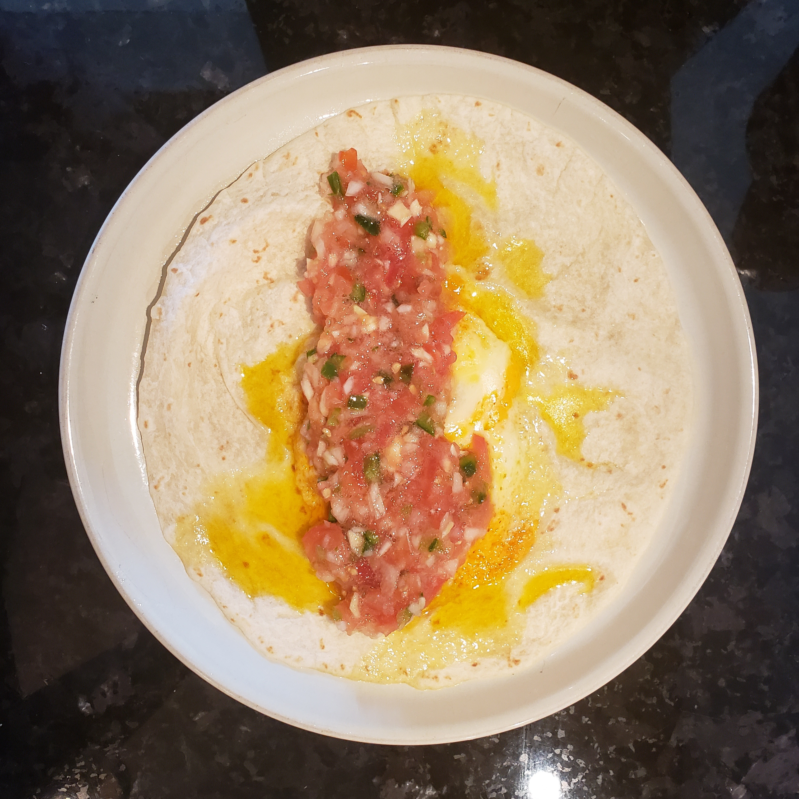
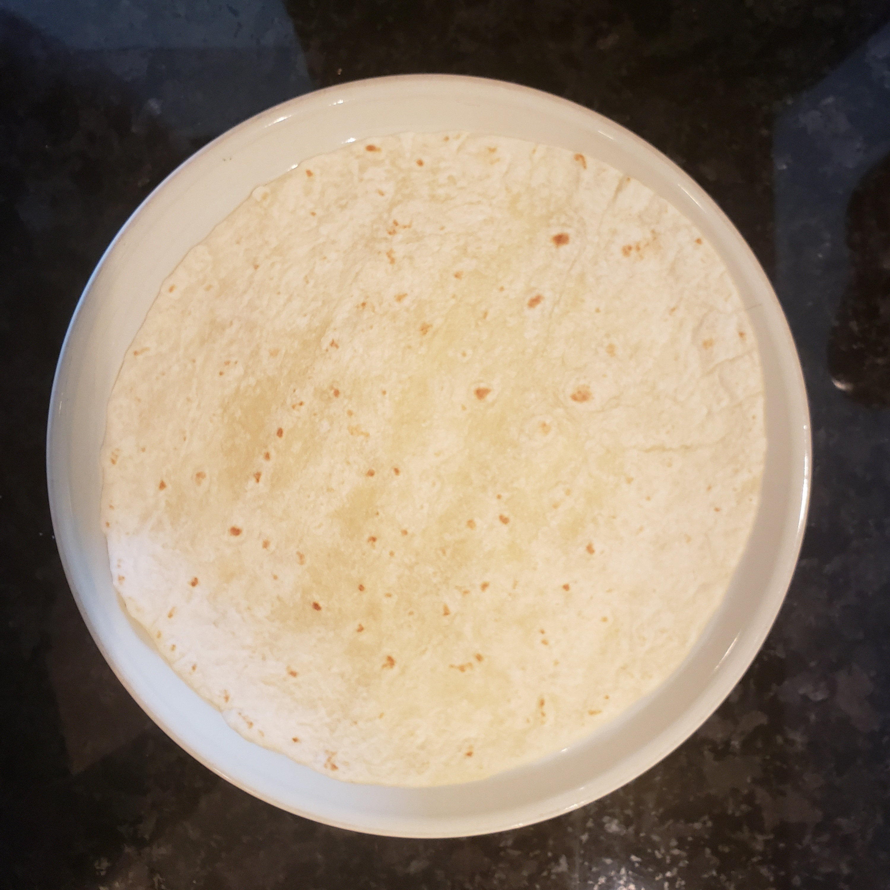
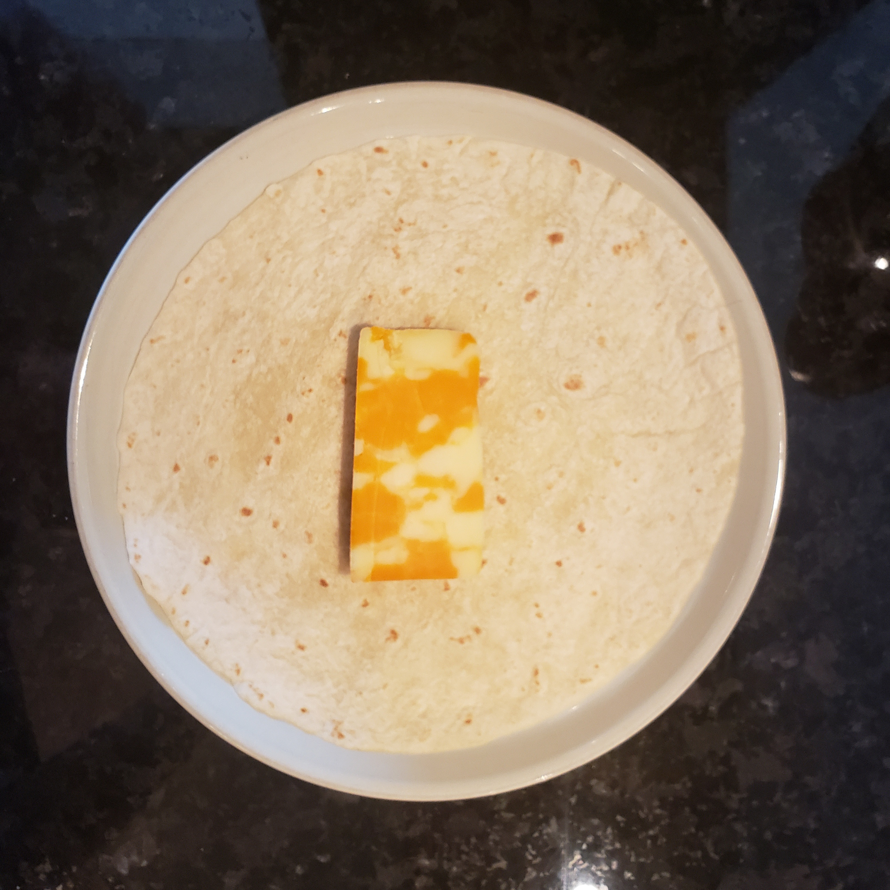
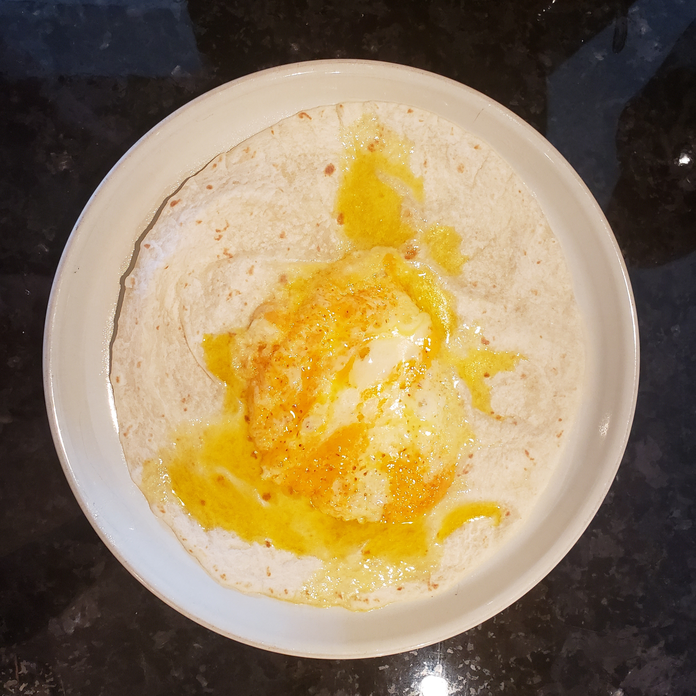

_[skip to the recipe](#the-recipe)_

I love eating food but I've grown to mostly hate cooking (it's too much work).

I need to keep myself fed but I would prefer to not have to resort [to ordering out all the time](/blog/2022-04-27).

So here we are, I'm going to be putting together some easy to follow Low Effort Meal recipes (with pictures). Some of these recipes, I've been making for years and others will have been recommended to me ([send me your recipes if you've got any](mailto:me@strategineer.com)).

The goal of this project is to help make it as easy for me as possible to cook healthy food for myself quickly. And, I'm doing the hard work so might as well share it with the world in case anyone wants to try some of these simple meals for themselves.

First up, is the Breakfast Quesadilla.

# The Recipe

## The Ingredients

  - 1x Big Tortilla (about 11in / 28cm or bigger)
  - Some good quesadilla cheese (you'll know it when you see it but I recommend marble cheddar)

_ put

