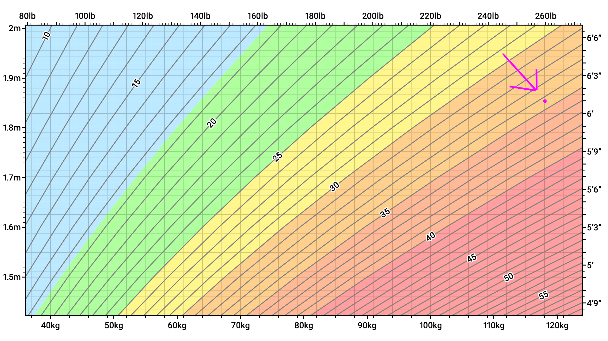

So I'm doing [intermittent fasting](https://en.wikipedia.org/wiki/Intermittent_fasting) again.

It works for me. It helps me reduce my weight in a sustainable way that doesn't disrupt my life (too much).

I don't want to lose much weight.

I don't have to.

From my _very_ unbiased perspective, I can assure you that losing 10 pounds would be enough to bring me to _very sexy man level_. Theoretically (I don't think it's going to happen but who knows), losing 20 pounds would bring me to _sexy Greek God level_.

Let's get something out of the way, [Body mass index AKA BMI](https://en.wikipedia.org/wiki/Body_mass_index) is bullshit.

Metrics based on averages give you average results.

The BMI falls apart completely for people like me with more muscle than the average person (that I worked very hard for, over many years, thank you very much).

Why?

Muscle is much denser than fat. If you have more muscle than fat compared to the average person that's not going to be accounted for properly in your BMI.

Let's take an extreme example to illustrate my point:

Apparently (don't quote me on this), Arnold Schwarzenegger at his peak weighed around 260 pounds and was 6 feet 1 inch tall.

If you take a look at the pink dot on this BMI chart below:

 _chart provided by Wikipedia, built using the BMI categories defined by the World Health Organisation (underweight, normal weight, overweight, moderately obese, severely obese and very severely obese)_

That would make our buddy Arnold at his peak:

_moderately obese_...

Ya, WHO that totally makes sense.

And, he's right on the cusp of being _severely obese_.

Of course, I'm no Arnold (no one is) but I like to believe that I have enough muscle that it's skewing my BMI results (just a little).

Whatever, I hope it's clear to you how much this DOESN'T bother me.

Anyway...

The first few days of IF can be challenging because your body is expecting the calories that it's used to getting, and you're denying it that privilege.

Thankfully, it doesn't take too long to get over that slump.

But when you're just starting out, you're left with very little brain power because most of your brain is occupied thinking about food.

Welp, here we are. I set out to write something and I wrote about food and fasting because of course I did, what did you expect?

I'm hungry.
