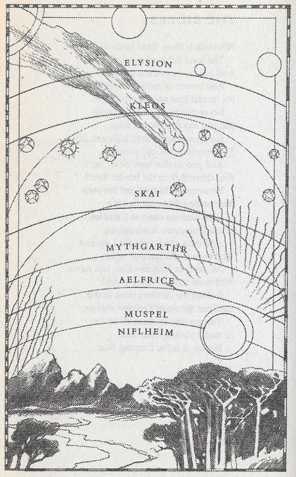

> This post contains spoilers for Gene Wolfe's The Knight.

> **What do you think is the deal with Abel and his inexplicable random acts of violence?**

At the start of the Knight, but this is made clear(er) only in retrospect, Able is young and naive. He's a boy in a man's body but he doesn't really know who HE is, yet.

The Knight is a journey of self-actualization for Able. He's discovering who he is by doing what kids do. They model their own beliefs and behaviours based on the beliefs and behaviours of the adults around them. In Able's case, early on in the Knight, before he's physically transformed into an absolute beefcake of a man, he has a brief encounter with a knight, Sir Ravd of Redhall.

Initially, this meeting isn't framed as being anything particularly notable for Able. Sir Ravd is a knight and the novel is called the Knight, so as a reader you might expect him to be important (you'd be right) but it's not presented as such. But by the end of the Knight, it's made much more clear that the foundation of Able's behaviour and beliefs can be traced back to his encounter with Sir Ravd.

If you'd like to see evidence for this link between Able and Sir Ravd, here's [a really rough draft of an essay on exactly this topic](https://strategineer.com/blog/2024-10-17/).

TLDR: As knights, Sir Ravd and Sir Able are in their right to commit acts of violence towards people below them in the social (as well as metaphysical, more on that down below) hierarchy they exist in to both stake their claim as knights and protect the people underneath them in the hierarchy. The King dominates/protects the Dukes, the Dukes dominate/protect their Knights and the Knights dominate/protect both their followers and the people of Mythgarthr (at least in Celidon, the land in Mythgarthr ruled by King Arnthor).

Trying to figure out why Able was acting the way he was acting throughout the story was a big part of the joy of reading the text for me but I can see how this experience could be frustrating. I was so enthralled by Wolfe's words that I felt willing to "go with it" and believe that Wolfe had written Able in an internally consistent way (after reading through both novels, I think Wolfe did).

Yet, this is only one piece of the puzzle that is Sir Able of the High Heart. Sir Ravd represents the foundation of who Able is, or wants to become, initially. But throughout the Wizard Knight, this relationship gets further complicated. Able makes mistakes, recognizes them and changes his behaviour and beliefs accordingly. I really enjoyed watching Able start as someone who's "faking it till he makes it" ("I am a knight") to eventually becoming the person he was always meant to be and that much more.

> **What is with the bizarre scene where he basically tortures the fire aelfs to swear off sutr while he continues doing exactly what sutr told him to do, completely blind to his hypocrisy**

The fantasy world of the Wizard Knight consists of multiple levels of reality, one built on top of the other. My copy of the Knight has the following map representing the 7 levels of reality at the start of the book.

In the Knight, the archangel Michael, a being from Kleos the level of reality above Skai, shows up and talks to Able. Michael summons the Valfather, a being from Skai, an Overcyn, who kneels to him. Michael explains to Able that this is the natural/proper way of things: beings in each level of reality should worship the beings in the level above theirs.

Michael explains that Able should be able to summon Disiri, an Aelf from Aelfrice the level of reality below Mythgarthr where Able usually hangs out, and that she should worship him, instead of it being the other way around.


“Uri and Baki come sometimes when I call them,” I told him. “Is that what you mean?”

“No.” Michael stroked Gylf’s head. “You must call her, or any of them, as those you call Overcyns would call you.”

“Will you teach me?”

Michael shook his head. “I cannot. No one can. Teach yourself. So it is with everything.” He closed his eyes, and a one-eyed man with a spear came out of the trees, knelt, and laid his spear on the ground at Michael’s feet. Gylf fawned on this one-eyed man.

Then he was gone, and the spear, too.


This isn't a problem that is unique to Able, this same inversion of worshipper and worshippee can be seen in the relationship between the Fire Aelfs, beings from Aelfrice, and Setr, a being mostly associated with Niflheim, the level of reality below Aelfrice.

I can't explain exactly why Able goes about rectifying this relationship between Setr and the fire Aelfs in such a violent way (but this is definitely something I'll be thinking about on my 2nd read).

But I can say that it both lines up with Able's actions as a restorer of the natural/hierarchical order of this universe as well as his understanding of knighthood being hierachical in the sense that knights should receive orders from above (their Duke) and both dominate and protect the people/beings below them (peasants or, in this case, Fire Aelfs).

