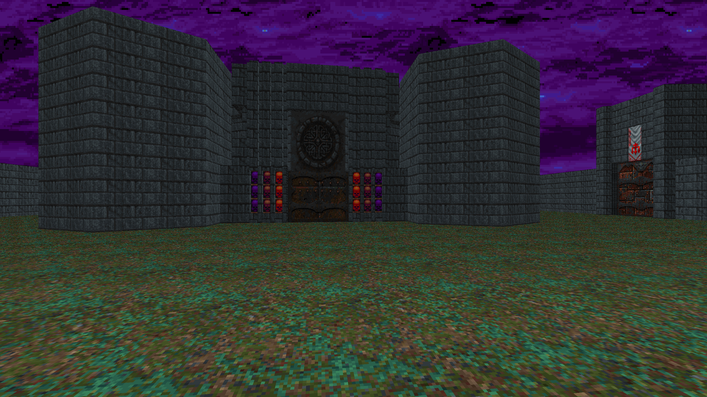
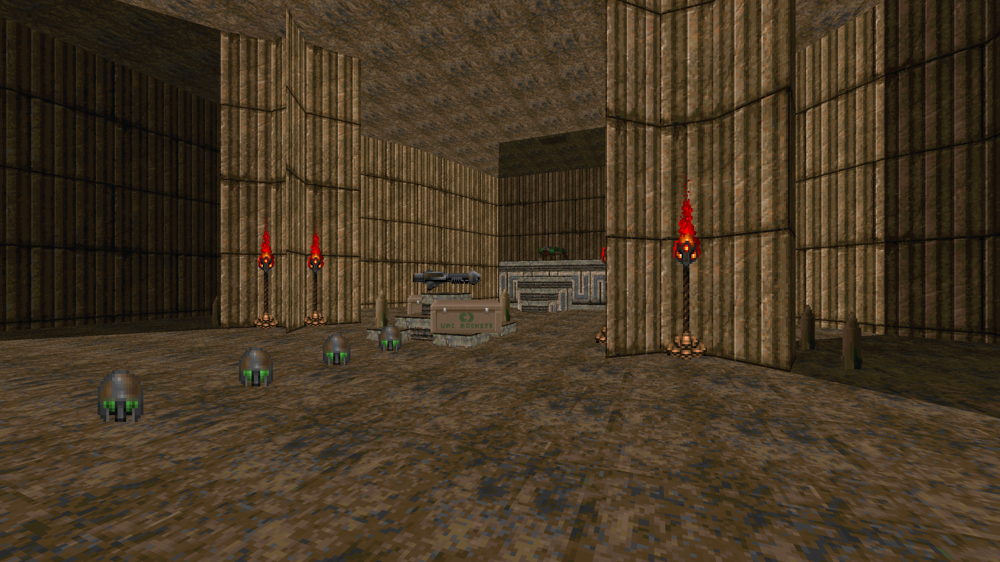
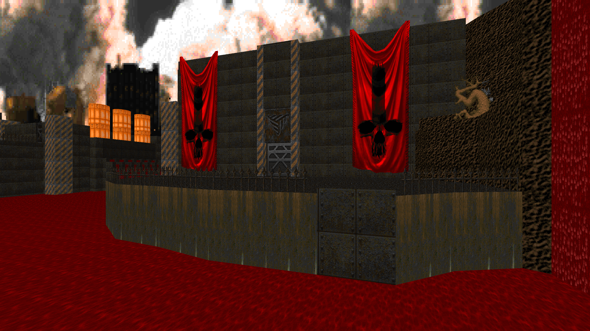
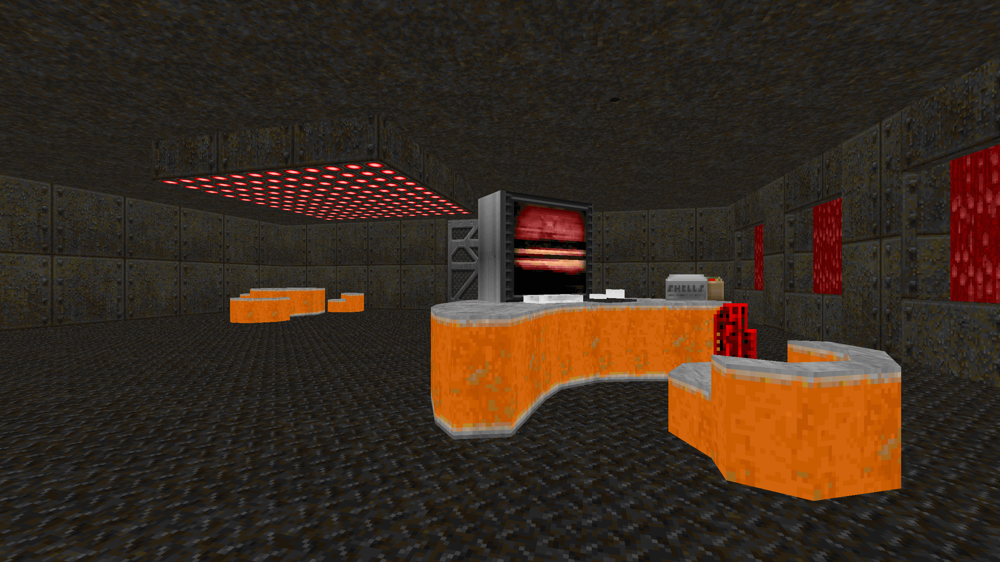
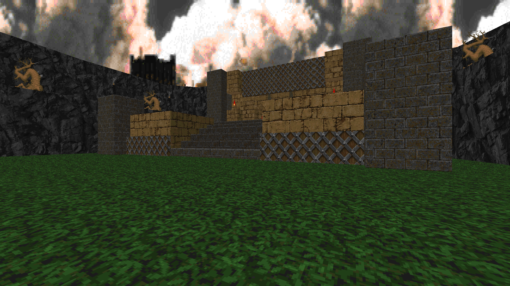
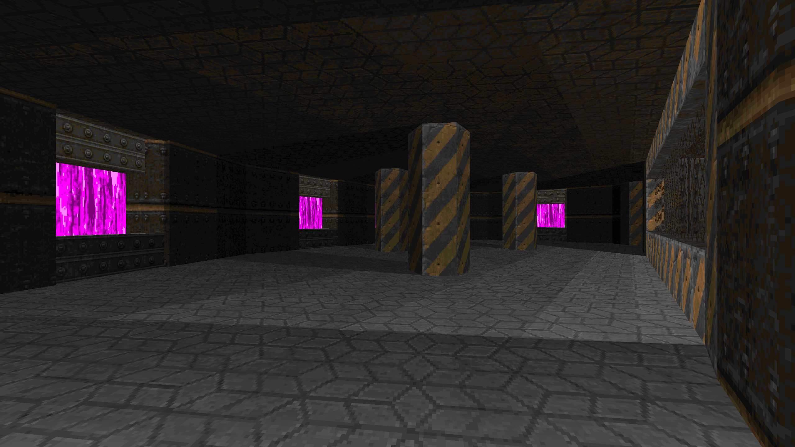
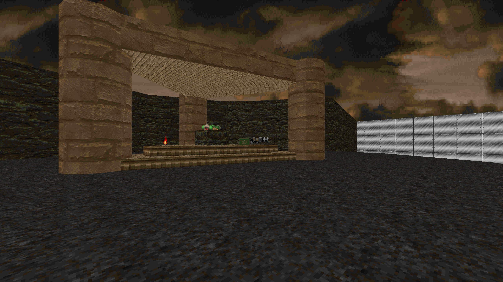
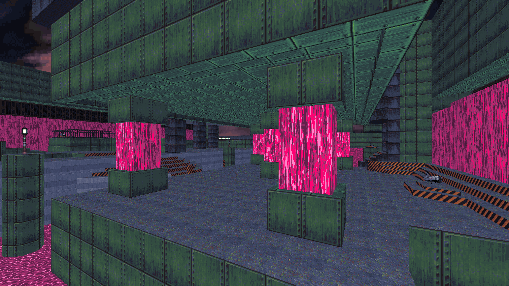

Have you been playing Doom II recently?

Probably not, but I have.

Why have I been playing a ~31 year old game in 2024 you might be asking yourself?

Well, it's simple really. It's fun. In the many decades since the release of Doom in 1993, a community of mappers has developed and has been hard at work using the framework of Doom games released in the mid 90s to create more, and better, Doom maps than you'd be able to get through in a lifetime.

Doom holds a special place in my heart being the first video game I ever played (the shareware version of Doom specifically).

Removing all of my nostalgia for Doom embedded in the deepsest recesses of my primate brain, I feel comfortable saying that the core Doom II gameplay loop holds up in 2024 especially when playing modern maps (even the older stuff has its charm) on modern source ports with great accessibility features (DSDA-Doom's keyframe rewinding feature takes the cake).

If you want to join in on the fun, do this (DM me on discord if you need help with any of this @strategineer):
- [Download the doom II wad from archive.org](https://archive.org/download/doom_wad_files/Doom%202/).
- [Download some maps, a good place to start is the annual Cacoawards](https://www.doomworld.com/cacowards/) or check out [some of the wads I've played recently and enjoyed](/wads/).
- [Download DSDA-Doom, a modern source port of Doom with great accessibility features and compatibility](https://github.com/kraflab/dsda-doom).
- [Run everything exactly the way you like through Doomrunner](https://github.com/Youda008/DoomRunner) ().
- Play Doom and enjoy!

# Doom Mapping Retrospective

I've also been getting back into making Doom maps. In hopes of figuring out how to do that better, I've played through each of the maps that I made last year and I've tried to learn from the mistakes I made and come up with a mapping process that'll help me make better maps with less pain and torture involved.

For posterity, here's all the wads I've made on my Doom mapping journey thus far with my notes on each of them written below. If you're interested in skipping straight to what I learned and my new mapping process, [here you go](#what-have-i-learned).

## [speed001.wad](/wads/speed001.wad)

- Tested in GZDoom.
- As short and simple as you can get.
- I remember spending at least an hour or two trying to figure out how to make doors work. Leaving me an hour to map everything else.
- At least you can finish it!

## [speed002.wad](/wads/speed002.wad)

- Tested in GZDoom.
- Looks way better than [speed001.wad](#speed001.wad) there's a much better sense of place.
- Mixed monster groups leads to immediate infighting, which gives a little bit of a "Doomguy isn't the main character" feel, which wasn't the intent here, and ruins combat balance.
- Not enough health packs and weapons are not given quickly enough or at all.
- No SSG, yikes. If a map has pinkies and revenants in it, the player should already have the SSG or a visible path to acquiring one (same goes for the rocket).
- Not enough ammo for full clear and no berserk pack means that punching all these monsters down is much less feasible or fun.

## [castle_of_doom.wad](/wads/castle_of_doom.wad)

- Tested in DSDA-Doom v0.28.2 (uses COMPLVL lump).
- My first (and only) entry into a community project, I'd like to do more of this soon.
- Just like in [speed002.wad](#speed002.wad) fighting against mid-tier monsters without the SSG is a pain.
- Nothing happens when I pick up the yellow skull, which makes for backtracking through this room not as interesting as it could be otherwise.
- 10 secrets per map was a requirement of the CP but I kind of ran out of time and just slapped secrets anywhere I could. The super slowly descending "secret" platforms are so painful. 
- Overall this is a better designed map than the previous two but not as visually interesting as the 
[speed002.wad](#speed002.wad).
- I'll be revisiting this kind of "spoke" map design in ouroboros.

## [tomb_of_doom.wad](/wads/tomb_of_doom.wad)

- Tested in DSDA-Doom v0.28.2 (uses COMPLVL lump).
- Funnest map to play so far.
- Some rooms are a little gimmicky and are only playable because I know what the gimmick is because I built them.
- I playtested this map with DSDA-Doom keyframe rewinding which means that it's probably way harder than I intended for it to be. I should probably not use DSDA-Doom's rewind feature when playtesting my own maps to playtest for the experience most players will have.
- It's a little too simple to navigate through but at least the routing is clear and foreshadowed (showing off locked doors before the player has the key, showing the player keys before they can get to them).
- Pathing is a little tight at times, every room could have benefited from being at least 25% bigger.
- Mostly cohesive map theming (gameplay + textures). Leveraging the Egyptian tomb aesthetic and combining it with traps, ritual sacrifice altars and a pyramid in the last room was a success.

## [jungle_fever.wad](/wads/jungle_fever.wad)

- Tested in DSDA-Doom v0.28.2 (uses COMPLVL lump).
- No exit. Unfinished.
- Great initial visual set piece. Starting your map off with something like this is worth it to hook the player into actually playing the map, even if the rest of the map isn't as detailed or visually interesting.
- Great first use doomcute.

- I have a weird fixation for putting weapons on gigantic pedestals, yes it makes them more visible for the player but it can look weird and feel weird to pick them up due to the elevation change. I should be a bit more subtle when doing this, instead of using elevation changes I can instead surround weapons with ammo to draw the player's eye to the weapon and/or use lighting to make the sector with the weapon stand out.
- An encounter with an Arch-vile without anything for the player to hide behind is not great.
- The gigantic room is cool but incomplete, needs more ammo, I need more monsters to teleport in as I hit buttons, what the buttons do should be made more clear.
- I think this map is salvegeable but I'd need to find some reference points for big open maps and open them up in UDB and figure out how they work. (EDIT: [Eviternity 2](/wads/eviternity2) MAP07 might be a good canditate for this)

## [ouroboros.wad](/wads/ouroboros.wad)

- Tested in DSDA-Doom v0.28.2 (uses COMPLVL lump).
- Cool-ish initial set piece.
- Using ammo "breadcrumbs" to hint at the reward that the player will find by going through each section is cool.
- More teleporting monsters or from closets after activating the buttons would have been good to make the backtracking less rote (same problem as in [castle_of_doom.wad](#castle_of_doom.wad)).
- There's way too much shotgun ammo on the map but not enough rocket ammo. Shotgun/SSG play can be a bit rote and samey whereas the rocket is more risky (because you can blow yourself up if you're not careful) and fun because of it.
- I can really feel the limitation of the strict time limit of speedmapping in this one, each room could have been just a little bit bigger and it would have been way better (similar problem found in [tomb_of_doom.wad](#tomb_of_doom.wad) and [castle_of_doom.wad](#castle_of_doom.wad)). Also, just a little more detailing would have gone a long way.

## [anox.wad](/wads/anox.wad)

- Tested in DSDA-Doom v0.28.2 (uses COMPLVL lump).
- Starting out in the vents. Muah, chef's kiss. Makes me feel like Snake Plissken.
- First appearance of pink nukage in my maps (which seems to be a recurring theme for me).
- This wasn't a speedmap and it shows. I'm really proud of the detailing work I did here. Just a little bit of detailing goes a long way.
- The red key platform room having windows looking through the rest of the complex is great visually and for foreshadowing purposes and also for allowing any monsters that the player leaves behind to still be a threat without resorting to teleporters.
- Once again, all of these rooms could have benefited from being at least 25% bigger but the lack of doors makes for smooth movement between rooms. As a default doors should only be used if necessary and the majority of enemies should be set to ambush, teleported in or revealed from a monster closet. 
- Way better placement of weapons, ammo, monsters, etc. in this map compared to the previous ones.
- The Outside room feels unfinished (because it is), there could have been enemies waiting ambush the player as soon as the player exits from one of the two red doors.
  - Although, maybe the intent here was to set up a sort of "calm before the storm" situation. If so, it works somewhat.
  - I'm also not sure why I decided to have two doors here, it doesn't seem like it adds much.
- BUT the set piece with cacodemons coming out of the water with revenants appearing behind you when you pick up the BFG is really great. Homogeneous monster groups means less infighting which is good (avoiding the problem we saw in some previous maps, especially speed002.wad)!
- Every room in this map could have been 25% bigger at least and it would have felt better moving around them (again). More obstacles within each room could be used to cut up the space a bit but still allow for more freeform movement.
- Slaughter-lite room at the very end works better than the big room in jungle_fever but isn't 100%.
- The ending switch is deflating. Initially I wanted a more interesting end to the level but I couldn't figure it out and I gave up.

## [auto.wad](/wads/auto.wad)

- Tested in DSDA-Doom v0.28.2 (uses COMPLVL lump).
- No exit. Unfinished.
- Pink nukage shows up again!
- Cool ritual sacrifice scene with fellow doomguy (like in [tomb_of_doom.wad](#tomb_of_doom.wad)).
- Caged imps show up again ([tomb_of_doom.wad](#tomb_of_doom.wad), [ouroboros.wad](#ouroboros.wad)).
- Salvaging elements from this map and [jungle_fever.wad](#jungle_fever.wad) would be interesting.

## [thereturn.wad](/wads/thereturn.wad)

- Tested in DSDA-Doom v0.28.2 (uses COMPLVL lump).
- The map I'm having a hard time figuring out right now. No items, just a basic layout and some detailing.
- The Rosy256 palette has potential, it makes the pink nukage textures pop.
- Cool looking pink nukage factory/hydro dam. (like in [jungle_fever.wad](#jungle_fever.wad)).

# What have I learned?

Looking through all these maps I've made (with most of them being incomplete) and thinking about my current struggles getting anywhere with [thereturn.wad](#thereturn.wad), I've tried to come up with a process for making maps that solves the roadblocks I've seen myself run into in the past.

I tried to come up with a process with the following traits:
- A goal-oriented mapping process that allows me to focus on smaller intermediate goals that I can achieve within a reasonable timeframe.
- A process that ensures that I can produce a playable map at any point throughout the process to allow for iterative development and testing. I don't want to be stuck with a pretty but unplayable map at the end of a mapping session.
- A process with natural stopping points which will allow me to step away from a map and allow me to say "I'm done", no matter what the current state of the map is. At the minimum, my maps should always be in a state where they can be played from start to finish without any problems. If the process works like I think it should then these maps will never be left in a state where they can't be completed by the player.
- A process with time and spatial constraints to clamp down on the infinite canvas that is a Doom map and prevent this from leading to analysis paralysis. Without mapping constraints, the infinite blank canvas in UDB is a strong demoralizing force for me. No matter how much work I do on a map. I could always spend more time on it, tweaking encounters, rebuilding areas that don't completely work and adding more detail to the environment, forever... And I'll never get anything done that way.

# The "Process"

**TLDR**: Do all the prep you can before opening Ultimate Doom Builder. Set a time limit for your session. Set expectations low and constraints high. Always produce a map at the end of each session that can be played to completion. Don't hyperfixate on detailing, if the map is fun then you can make it pretty but not before. That's it, basically.

- Before sitting down at the computer to start mapping, I should come up with the following things:
  - Draw a layout for the entire map by hand on paper or whiteboard.
  - The map's theme/premise and a .wad with all the textures I'll be using I'll be using.
  - Copy over an existing project directory with doommake scripts ready to go
- Set a time limit for the entire mapping process once I've sat down and opened up Ultimate Doom Builder, by the end of the timer I'll need to have a fully playable and fun map to play, if a little basic, so the following steps keep that in mind:
- Add a spawn point and create an exit switch to ensure that the map is always completeable.
- Create the basic layout of the map in UDB using hand drawn layout from earlier as a guideline (no switches, no doors, no detailing)
- Working mostly on one section of the map at a time:
  - Nail down the scale of the map and make the movement of the player through it fun, leaving space for monsters and other Things to be placed in the next step
  - Instrument the map with linedef actions as needed to block/open up progression, open monster closets and teleport monsters in
  - Add all the Things to the map: monsters, weapons, ammo, healthkits, keys/skulls
  - Make it fun!
- When the timer run out, you're done (for now). Move the exit you've built previously into an appropriate location that's reachable by a player spawning from the spawn point of the map. You've got a map!
- If what you've built of the map so far is fun to play and has potential, then you can go to the next step, otherwise you're done, take some screenshots of the map and record yourself playing through it, while commenting on what works and what doesn't work.
  - [OPTIONAL] You can repeat this process from the first step, but this time look at the map as it is, and figure out what you'd like to add/change in it to make it better than it is now. If you weren't able to finish up rooms that you drew in your initial layout, you can build those out 
  - [OPTIONAL] You can continue working on a map forever, so deciding to call a ap
  - [OPTIONAL] If your map is ready to share (up to your discretion), share your map wherever you can!
    - Share some enticing screenshots (if you can't come up with any, that might be a problem to solve with your next map).
    - Describe the premise of the map and make it interesting if you can, but don't oversell it, be honest.
    - Set expectations for the sorts of feedback you're willing/hoping to get.
      - Describing parts of the map that you're particularly curious about might help. 
    - Worst case: you share your map with the world and nothing happens. If the stars align, someone will take the time to play through your map and give you feedback.

That's about it for now.

I'll post here again once I've got a new map to show. I hope that this process helps me get there.