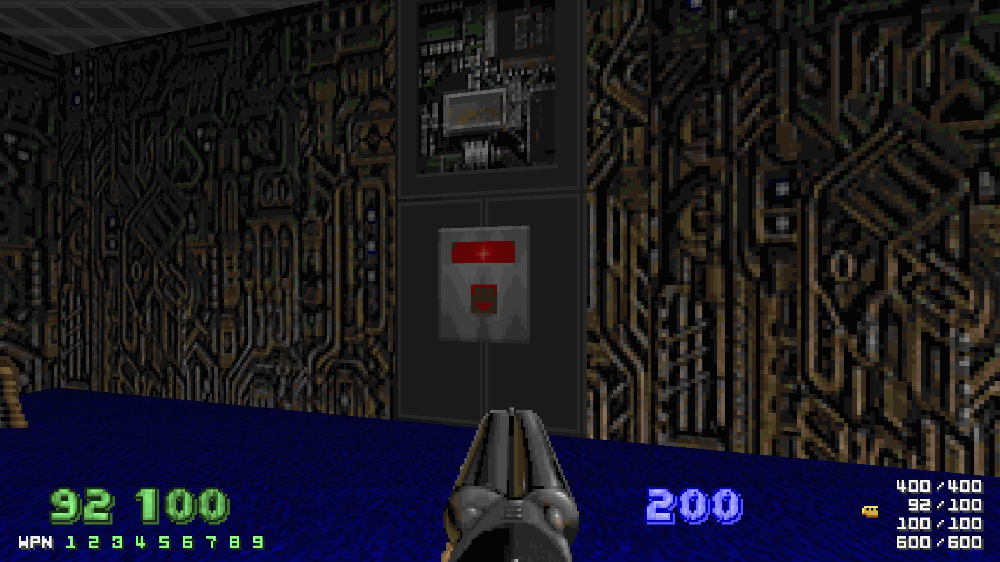

- Gameplay holds up
- the .wad format being 100% open and built from the ground up to be easily remixed and re-used by others 
- accessibility (keyframe rewind, cheats at the press of a button)
- infinite contents of map
- foundation of doom and ecosystem supports single "auteurs" creating work that is unique to them and allows them to extend and build on what Doom is or subvert and break existing expectations and everything in between 

<!--more-->

For example, Nicolas Monti in Cyberpunx MAP03 does weird auteur shit, here's just the tip of the iceberg to give you an idea of the things you can run into in a Doom map.

I'd argue that playing Doom you are allowed to do 3 things:

1. You can run at around 500miles an hour.
2. You can use firearms to kill demons.
3. You can activate switches.

In Cyberpunx's MAP01, Nicolas Monti sets the stage for the entire wad by designing one of the meanest maps I've played which hampers and removes to some extent the 3 abilities that the player has access to mentioned above.

Playing through this map I began to sense a hostility in its design coming from the mapper. The corridors are as cramped as they can be, being just wide enough to allow the player to squeeze through them. Limiting the player's movement to this extent is rare to see in a wad. According to Monti, he intended some of these maps to make the player feel a sense of desperation, IMO he succeeded.

A few seconds into playing the map, I found myself in front of the following button.

Bbuttons in Doom are begging to be pressed because they are almost always provide the player with a path to navigate closer to their goal, the exit of the map.

And I pressed it...

And nothing happened.

I tried pressing it again. And nothing happened.

I raised my fist into the air and cried out to the God of the realm I found myself in (Monti) begging for him to explain how he could place a button in his map that didn't do anything when pressed.

I took a deep breath and continued playing the level. I tried to find a way to progress the map and find my way to exit.

I found myself both ripping and being torn travelling along these cramped corridors. I continued contemplating the button that I couldn't press and the truly deranged auteur that could have chosen to put something that wild into a Doom map.

Eventually, I found myself faced with the following:

[insert screenshot of this here]

An Arch-Vile resurrecting the corpses of his fallen demonic brethren right beneath a portion of the ceiling moving up and down dealing damage to anything beneath it, commonly called a Crusher.

[...]

Something to note before continuing is that Cyberpnx contains a Dehacked patch modifiing the behaviour of the weaker enemies in the game, by making them slightly faster than they are supposed to move originally. 

... This leads to the ghost monster bug

Soon enough, Monti has put all his eggs into one basket by forcing me to find a way to deal with a growing horde of enemies that disregard walls (they simply walk through them) who are invisible and can zoop through the map faster than they could have otherwise because Monti made it so.

...

By the skin of my teeth, I pull myself through (who am I kidding, I cheated my way through this nonsense just like I did when I was a kid although this time I didn't call Papa to come and type in the god mode cheat for me).