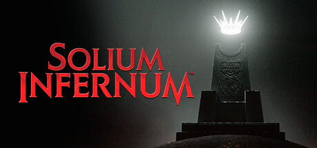
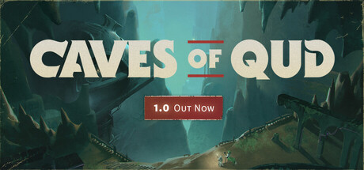
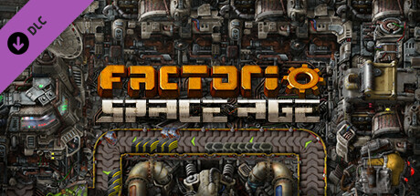

A list of games, in randomized order, released in 2024 that I played and enjoyed.

<!--more-->

# 1000xRESIST

Running around the hub level sucked ass but everything else in 1000xRESIST is so good that it almost doesn't matter.

The more time I've spent thinking about this game after beating it the more I like what it's doing and how it blows most other games out of the water narrative-wise.

# WARNO

The Cold War never ended and it's about time we got this Hot Pocket cooked.

WARNO the low APM RTS that I've been waiting for my entire life.

# Pacific Drive

What if you combined S.T.A.L.K.E.R. and Car Mechanic Simulator?

Pacific Drive is the only survival crafting game I've played that actually works as a survival crafting game and not a hit a tree over and over again to make the number go up simulator.

# Lorelei and the Laser Eyes

Gameplay, visuals, sound design, music, narrative, it's all insanely great and cohesive. It knows what it is.

The opposite of Metaphor: Refantazio.

# Solium Infernum

Satan's on vacation and it's time for you to fight for your right to become the next Lord of Hell. It's a good Free for all diplomatic strategy game.

The studio shut down and the game's not balanced but I spent 100 hours playing this game this year.

The multiplayer games I love are cursed. 

# Surmount

Procedurally generated 2D physics-based mountain climbing game. The procedural generation in this game is insanely good and works perfectly and makes speedrunning it really fun.

[got to go fast](https://www.speedrun.com/Surmount)

# Echo Point Nova

Cracked out of its mind Jet Island for pancake screens.

The movement shooter to dunk on all other movement shooters.

It's not as big budget as Titanfall 2 but Echo Point Nova makes up for that with a lot of heart and soul.

# Mechabellum

It's a turn based real time strategy game. It's got a lot of depth.

# Caves of Qud

I don't even really like this kind of traditional roguelike but I've been CoQing for ~17 years and I've put almost 300 hours into the Steam release so what do I know.

# UFO 50

50 good ass games. Waldorf's Journey 2P mode is my game of the year.

# Factorio Space Age

THEY FUCKING FIXED THE TRAINS

THE TRAINS ARE FUCKING FIXED

THEY FUCKING FIXED THE TRAINS

also there's new planets to explore and exploit (are we the bad guys?).

# Peaks of Yore

First person physics-based climbing game. What can I say? I love climbing.