A tier list of the UFO 50 games I played in 2024 (from most fun to least fun).

<!--more-->

| Tier | Cart | Title | Notes |
| --- | --- | --- | --- |
| S+ | 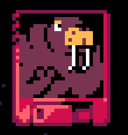 | Waldorf's Journey | My GOTY. The 2P mode is a masterpiece of game design. It's a simplified platform fighter --- think Divekick combined with Smash Bros with procedural arenas that make the game really replayable. |
| S | 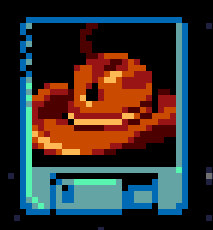 | Rail Heist | A real-time AND turn-based side-scrolling game where one player controls bandits hijacking a train and the other player controls the sheriff's deputies defending the train. It's weird and it rocks. |
| S | 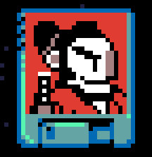 | Bushido Ball | Windjammers + Lethal League with a sports theme that encourages you to break the rules of Bushido Ball just enough to get an advantage over your opponent without being penalized. Bushido Ball offers a lot of opportunities for both mind games and quick reflexes while being easy to learn but hard to master.  |
| S | 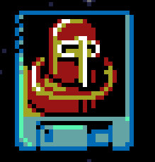 | Lords of Diskonia | XCOM + Croquinole. Each player moves a token on a procedurally generated overworld  while hiring mercenaries, taking over gold mines and gaining skills. When a player's token crosses paths with the other player's token, the game zooms into a procedurally generated battlefield with units on both sides of the conflict represented by circular Croquinole-like tokens, each with different attack and HP values as well as special abilities. Players take turns smashing tokens into one another, bouncing them around until one side's troops are defeated. The combination of strategy and physics-based shenanigans is beautiful. |
| S | 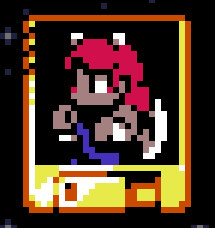 | Hyper Contender | A 2P platform fighting game with many characters --- each with unique movement mechanics and special abilities. I want to play this game a lot more. |
| S | 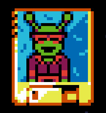 | Party House | My roguelike deckbuilder of the year. A push-your-luck game where you invite various people to the titular Party House every night, trying to party as hard as possible, expanding your house and acquiring more guests, without the cops showing up. |
| A | 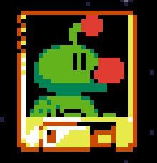 | Quibble Race | Quibbles are little guys that are forced (?) to race each other (think horse racing) and you as the player bet on them while influencing the results by bribing/drugging/buying/training the quibbles. Whoever makes the most money wins. Gambling can be fun, who knew? |
| A |  | Avianos | A 4X game with great mechanics and theming (birds worshipping dinosaurs). Sadly, the fog of war mechanics are essential and the 2P mode requires you to look away from the screen to make them work which isn't great... |
| A | 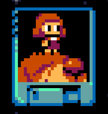 | Mini & Max | A 2D collectathon platformer. You get big and you get (really) small and you explore the world that way. Deep in an unexpected way. |
| A | 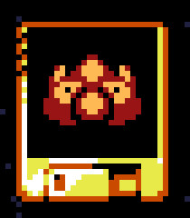 | Bug Hunter | A procedurally generated turn-based strategy game where you move on a grid, shoot monsters and upgrade your abilities turn by turn. Not as deep or replayable as you would expect but it's fun for a little while. |
| A | 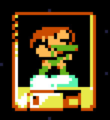 | Velgress | Reminds me a lot of Icy Tower, the freeware tower climbing game I played a ton in the early 2000s. Also feels like Downwell but going up instead of down. It's snappy, it's hard but fair. |
| A | 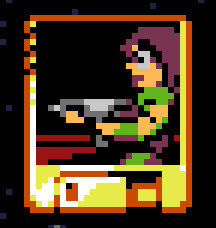 | Overbold | A push-your-luck roguelite Robotron or Smash TV. It rocks. |
| A | 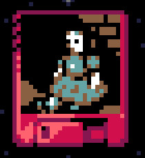 | Night Manor | A spooky adventure game (the only one in UFO 50). It's got great SFX, art and non-moon logic puzzles. |
| A | 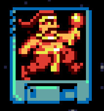 | Rakshasa | A Ghosts 'n Goblins-like hardcore platformer. Probably the hardest game in UFO 50 so despite spending quite a long time without I haven't gotten very far. |
| B | 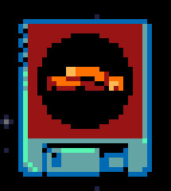 | Mortol | A puzzle platformer with hidden depth (like a lot of other UFO 50 games) |
| B | 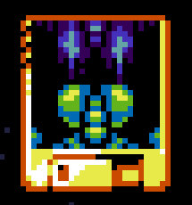 | Vainger | A bite-sized metroidvania that I had a lot of fun with despite not liking metroidvanias much. |
| B | 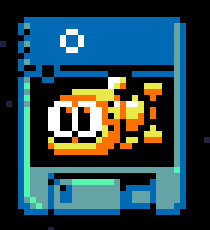 | Porgy | A push-your-luck underwater stealth metroidvania with big bosses you need to avoid until you can fight them with upgrades. Surprisingly good! |
| B | 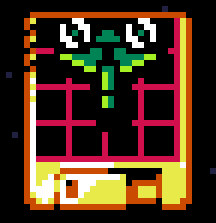 | Warptank | A fun little puzzler. |
| B | 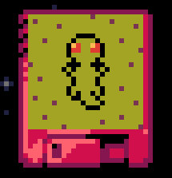 | Camouflage | A little puzzler but not as good as Warptank. |
| B | 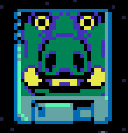 | Valbrace | A dungeon crawler with Punch-out!!-like combat. I wish I liked this more than I do. |
| C | 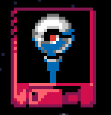 | Pingolf | It's pinball-golf. There's bumpers and there's 18 holes --- Pingolf is exactly what you think it is. The procedural generation is minimal and the interactivity between players being non-existent makes for a game that's fun once but not mind-blowing. |
| C | 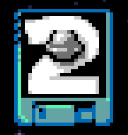 | Campanella 2 | I need to spend some more time with this game. It's weird. |
| C |  | Attactics | A real-time tactics game where you move units between different lanes waiting for them to advance eventually smashing into each other or the enemy castle. This might be fun with another player. |
| C | 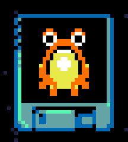 | Devilition | A theoretically interesting puzzler but the bad UX (no undo button) detracts from the experience. |
| C | 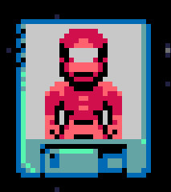 | Planet Zoldath | A procedurally generated top-down Zelda-like. It's ok. |
| C | 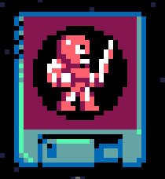 | Mortol II | A puzzle platformer of sorts. A sequel to Mortol but I don't know if I care much for the new take. | 
| C | 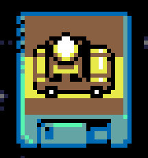 | Onion Delivery | Driving around looking through a GTA 1/2-style perspective doing, presumably, onion-related deliveries is torture. But I'd like to spend more time with this game in 2025. |
| C |  | Fist Hell | A beat-em-up. I'm not into beat-em-ups. This is OK with a friend but not something I'd play over the other 2P games in UFO 50. |
| C | 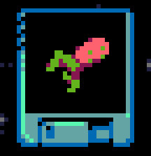 | Mooncat |  A QWOP-like. Torture (non-derogatory). |
| C | 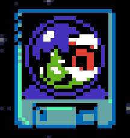 | Elfazar's Hat | A top-down shmup with cute art. |
| C | 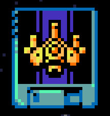 | Star Waspir | A classic vertical shmup. |
| C | 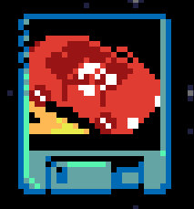 | Seaside Drive | A 1D side-scrolling shmup. |
| C | 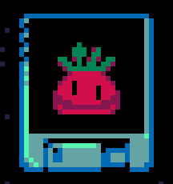 | Caramel Caramel | A 2D side-scrolling shmup. There's too many shmups in UFO 50 and I'm too bad at them to be able to see if there's anything interesting in them. But I can imagine getting a sense of pride and accomplishment if I were to get good at these games in 2025... |
| D | 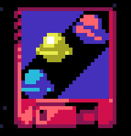 | The Big Bell Race | A racing game that is more fun with a friend but isn't very interesting overall. |
| D | 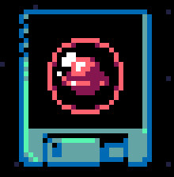 | Campanella | An unforgiving moonlander-style platformer. It's got meh gameplay with no checkpoints so I don't want to play this. It's not interesting enough for me to push through the pain.  |
| D | 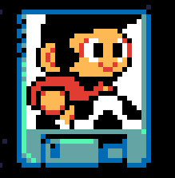 | Kick Club | A sports-themed Bubble Bobble-like. Not my jam. |
| D | 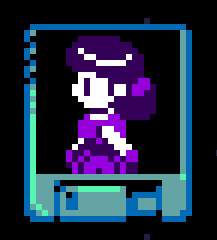 | Magic Garden | A Worm and Pacman-like... I don't get it. |
| D | 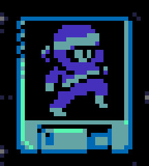 | Ninpek | Nahhhhhh. |
| D | 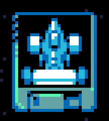 | Paint Chase | A 1v1 racing Splatoon-like. Seems very solvable and not interesting in 2P. |
| D |  | Pilot Quest | An idle game with top-down Zelda-like combat. I don't know. |
| E | 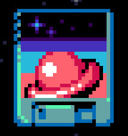 | Campanella 3 | Ummmmm. Uhhhhhh weird. |
| E | 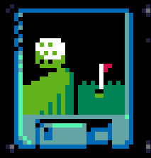 | Golfaria | Torture (derogatory). I thought I liked golf games but I don't know anymore. |
| E | 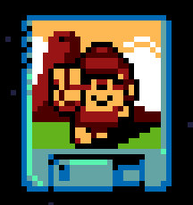 | Rock On! Island | Miss me with that tower defense shit. I'm probably missing something here. |
| E | 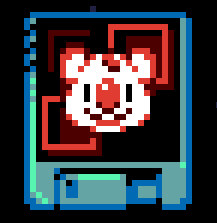 | Block Koala | Friends don't let friends play block pushing puzzle games. |
| F | 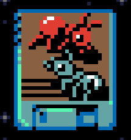 | Combatants | The only UFO 50 that seems like a joke that I don't understand. It feels like absolute shit to play this game. |
| JRPG | 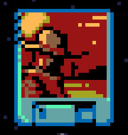 | Grimstone | A cowboy JRPG. Even though this JRPG has a cool premise, an interesting game loop and fun combat --- it's still a JRPG. |
| JRPG | 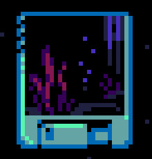 | Divers | A weird underwater diving JRPG. I don't understand it. |
| N/A | 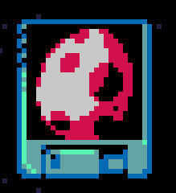 | Barbuta | A La Mulana-like but I haven't played enough of it to judge. |
| N/A | 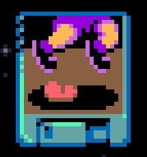 | Hot Foot | I don't get this (yet) but I'd like to play this with someone and see if we can figure it out. |
| N/A | 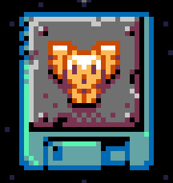 | Cyber Owls | The audacity of the 50th UFO 50 game being 5 games in one is wild. But haven't given this game the chance it deserves. |
{.table .table-bordered .table-sm}

And there you have it.

UFO 50 is a game that's been on my radar for 8-9 years. To see it finally come out in 2024 and be as good as it is feels great. I can see myself coming back to UFO 50 for the foreseeable future if only to continue playing some of these multiplayer games that are SO GOOD.

I also plan to continue following along in 2025 with the [Eggplant - A Year of UFO 50 series](https://eggplant.show/), pushing through their constant jumpscare SFX, music and community voice messages, as they continue to do deep dives on all the UFO 50 games in chronological order.