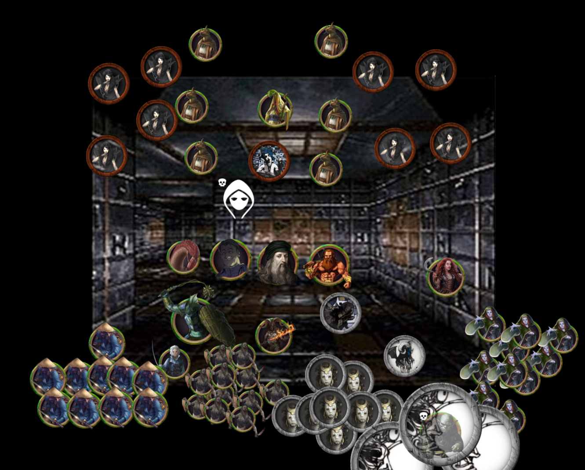

Running a tabletop RPG campaign is always a learning experience. In this post, I'll share insights from my recent campaign, the Labyrinth of the Blue Gorgon, and the lessons I learned as a GM.

<!--more-->

I ran the Maze of the Blue Medusa megadungeon using the Shadowdark RPG rules through Foundry Virtual Tabletop between September 2024 and January 2025.

I've spent most of [my short GMing career](/blog/2024-11-18/) trying to run fantasy campaigns that weren't tropey and filled with questionable politics. This is the second OSR-style campaign I've run, but this was my first time tackling a proper megadungeon, and a weird one at that.

By the end of this post, you'll have a clear idea of how Shadowdark fared, how Maze of the Blue Medusa plays, and actionable tips for running games through Foundry VTT online.

To start, I'll summarize the campaign, then I'll go over the lessons learned about each part of the campaign individually, and finally, I'll cover insights gained from the campaign as a whole.

This is a really long post, so I've tried to make it as skimmable as possible. Here's a table of contents with concise section headers for you to skim at your leisure:



# Campaign Summary

A wizard contracted a ragtag group of petty criminals, con artists, and thieves (the PCs) to steal a painting. The PCs were pulled into it, finding themselves trapped within the Labyrinth of the Blue Gorgon.

The PCs explored the dungeon: solving puzzles, meeting friends and foes, and everything in between.

Eventually, the PCs were given an opportunity to end the tyranny of the Blue Gorgon, leading to a final encounter with the Blue Gorgon herself. The PCs gathered their many allies and brought them to the door of the Blue Gorgon's lair.

They found the Blue Gorgon, having read the writing on the wall, working through her fate and telling her Chameleon Women devotees to stand down.

The group found themselves collaborating with the Ashen Chanterelle, who planned to rescue the Three Perfect Sisters from the labyrinth and rebuild the fallen Empire they once ruled, long since forgotten and buried by the world outside of the labyrinth.

The campaign ended as the ragtag group of scoundrels found themselves being promised positions of power within the administration of the soon-to-be rebuilt Empire led by the Chanterelle.

The end.

# Shadowdark RPG

## What's cool about Shadowdark RPG?

### Concise, efficient rules

There's a lot to like about Shadowdark, but its defining feature is that it's surprisingly **elegant** (considering that it won the [Ennie Award for Best Game in 2024](https://ennie-awards.com/portfolio-item/2024-nominees-and-winners/), this shouldn't come as too much of a surprise).

The rulebook is a masterpiece of design--it's one of the best-laid-out rulebooks I've read. The rules are concise, clear, and comprehensive enough to allow new and experienced GMs to run fun Shadowdark games right away.

### A great OSR system for less experienced GMs

The Shadowdark RPG rulebook is incredibly helpful for GMs. It doesn't assume years of experience and provides clear instructions on how to run the game.

For example, how do you, as the GM, emphasize the danger and urgency of exploring a dark, dank dungeon? Many OSR systems assume you already know how to do this.

Shadowdark RPG rules go out of their way to give GMs--who've never run an OSR game like this before--guidance on exactly how to do it.

Shadowdark's masterstroke is that 10 minutes of real time represents 10 minutes of game time. And, depending on how dangerous the area the PCs are in, every so often you'll roll a d6 to check for a random encounter. On a roll of 1, the PCs encounter something or someone.

This makes it clear that spending real time discussing next steps or in-game time searching under every tile in a room for traps increases the risk of a random encounter.

The system encourages players to just **do** something, which tends to be more fun and helps keep the game from becoming a slog.

While experienced GMs can solve these problems intuitively, Shadowdark RPG provides explicit guidance; which is incredibly helpful for new GMs. This ethos makes Shadowdark RPG stand out among its many OSR peers.

I can't stress enough how amazingly concise and useful the rulebook is. Still, it won't be a perfect fit for every OSR campaign you're going to run.

## What's less cool about Shadowdark RPG?

### Supplemental classes are inconsistent

Some of the classes found in the Shadowdark official zines feel out of place, too strong, or too weird compared to the classic Fighter/Rogue/Wizard/Cleric classes described in the core rulebook.

Although it didn't cause any serious problems in our campaign, it was an interesting challenge balancing combat encounters involving Brod, the tanky dwarven Pit Fighter with 30 HP, and Blotbug, the squishy goblin Witch with 5 HP.

I would suggest thinking carefully about allowing players to pick any of these extra classes in your campaign--especially for players new to roleplaying, who'd be better served by playing a more iconic and simpler class.

### Darkness rules are hard to use

The only thing that isn't elegant about Shadowdark is its handling of darkness and how little it helps you run a fun game where light is a resource that has to be managed.

Unless you can figure out how to fill your dungeons with water-splashing enemies (like the book recommends) without making the dungeons feel more like waterparks, you're likely to run into the same problems I did with the darkness rules.

Thankfully, I found that the game works fine even if you mostly ignore these rules.

---

In summary, Shadowdark is a really well-designed OSR dungeon crawling roleplaying system, but it's not perfect. With that in mind, let's delve into the centerpiece of this campaign: the Maze of the Blue Medusa.

# Maze of the Blue Medusa

## What's cool about the Maze of the Blue Medusa?

I read dozens of modules in preparation for running this campaign. I was looking for something special to give myself the solid foundation I felt like I needed to run my best campaign yet.

The Maze of the Blue Medusa megadungeon fit that bill perfectly--it's cool, it's out there, and it's also very me.

### Great abstract, surreal art combined with evocative descriptions

The Maze of the Blue Medusa is the product of a collaboration between Zak Sabbath and Patrick Stuart. Sabbath drew abstract, surreal room art and would send his art to Stuart, who would then write room descriptions based on that art. This back-and-forth continued for several years, producing the one-of-a-kind Maze of the Blue Medusa.

Despite this process, the megadungeon doesn't feel as much like a funhouse as you might expect. The megadungeon is partitioned into sections with common visual, literary, and gameplay themes, which helps connect the rooms together into a cohesive whole.

### Weird, unique NPCs

Interesting factions and NPCs inhabit the dungeon. You can leverage these to further connect the disparate sections of the maze with each other and, in doing so, make the dungeon come alive for your players.

There are hundreds of NPCs in the Maze of the Blue Medusa, and I can imagine any one of them becoming a character that your players never forget.

It's hard to understate how out-there and unique most of these NPCs are.

### Everything is weird

Despite providing ample classic dungeon-crawling puzzles and combat encounters, the Maze of the Blue Medusa refuses to play any of it straight--every room, every NPC, and every puzzle is a little surreal, a little absurdist, a little mythical, a little weird. That's what got me interested in the Maze of the Blue Medusa in the first place.

It didn't disappoint. You can expect players to encounter psychic pigs, laughing liches, book-worms, robotic peacock butlers, cannibal critics (they eat artists)--I could go on.

As long as your players are open-minded enough to play in this off-beat fantasy setting, then the Maze of the Blue Medusa would be a great choice to include in your next OSR campaign.

It executes this weird vibe so well that, even though the megadungeon isn't perfect, what it does do well is so unique that it more than makes up for its minor failings.

Let's discuss what makes the Maze of the Blue Medusa less than perfect.

## What's less cool about the Maze of the Blue Medusa?

### Some exceptionally boring rooms

The Maze of the Blue Medusa is a big megadungeon, and not all parts of it were created equally well. Overall, the quality of rooms is high, but there are a few that fall short.

An example is room 48 – Niu-Nga-Ma:


A shell, 8' long, white, and patterned in green-white whorls the color of new leaves holding a layer of fresh unseasonal snow. Living in the shell is a large snail. Its limbs wave uncertainly like fingers seen through whiskey, somewhat transparent and indistinct.

Niu-Nga-Ma is not a true snail but a kind of golem created by Aelfadred The Glyph Witch (Gardens 58). She can hear anything the snail hears through a shell she keeps in her room. Likewise, Niu-Nga-Ma can hear anything that happens near the other shell.

**Niu-Nga-Ma**

AC 16, HD 4, ATK d8/d8


How a GM could make this "encounter" interesting is beyond me.

There are a few rooms in the Maze of the Blue Medusa that asked me to fill in the gaps way more than I was prepared for--these rooms left me scratching my head in confusion (which is never a good position for a GM to find themselves in at the table).

I imagine that a more well-prepared and experienced GM would be able to read a questionable room description like this one and decide to replace it with something else on the fly. That wasn't the case for me most of the time.

### Some players won't vibe with the abstract, surreal art

The room and NPC art in the Maze of the Blue Medusa tends to be quite abstract and doesn't often accurately convey what NPCs actually look like. This made it harder for the more visually inclined players in the group to imagine themselves in these spaces and around these NPCs.

This put a little extra pressure on me to describe NPCs in more evocative ways and to find less abstract art to use as token art to represent these NPCs on the VTT.

It was challenging because of the large number of NPCs in the megadungeon and their unique looks, which were often impossible to find exact or even close matches for.

### Interactions between factions are mostly left for the GM to figure out

The Maze of the Blue Medusa book could have done a better job of helping you run it by providing more examples of how the factions could interact with one another in interesting ways.

The book could have been much more explicit about this in more places, instead of leaving it mostly up to the GM to make all of these connections on their own.

For example,


Bringing the "Oku" (magical bird cosplayers, essentially), who are natural thieves and scavengers of knickknacks, into conflict with the Cannibal Critics, who are mostly feral zombies consuming artists in the art gallery, would be a great idea.

Interactions between factions like this aren't mentioned often in the book, and I think it'd be better if they appeared more often.


---

So, the Maze of the Blue Medusa is great. The Shadowdark RPG system is great. Let's discuss the challenges of running the Maze of the Blue Medusa using the Shadowdark RPG rules.

# Is Shadowdark RPG a good fit for running the Maze of the Blue Medusa?

Short answer: no.

The Shadowdark RPG seems to want you to focus on the player characters' struggle to light the path forward and avoid darkness at all costs.

Large sections of the Maze of the Blue Medusa are designed to be well-lit and wouldn't work at all if they weren't--which made it hard to implement Shadowdark's "light as a resource" mechanics in the campaign. Thankfully, the Shadowdark RPG system holds up even if you mostly ignore the darkness parts of the rules.

While I'd consider running a Shadowdark RPG campaign again, I wouldn't recommend it for running the Maze of the Blue Medusa without the caveats above.

---

Now that we've covered how the Shadowdark RPG supports, or doesn't, running the Maze of the Blue Medusa megadungeon--I'll now share the many lessons I learned from running this campaign.

# What did I learn GMing this campaign?

## What did I learn GMing a megadungeon?

### Use an NPC checklist to ensure that NPCs are reacting appropriately to the PCs' actions

> Takeaway: "Always maintain a simple list of NPCs, their motivations, and how they’ve reacted to the party to keep the world feeling alive."

If I were to run a campaign with this many different NPCs again, I would write a list of all the factions/NPCs that the PCs have met (and important ones that they haven't met), their current relationship with respect to the PCs, and their goals.

I would review it after every session to ensure that I was prepared to make factions and NPCs in the world react appropriately to the actions of the player characters and, more generally, to the events taking place in the game world. This would make the world come alive for players and add more weight to their actions within the game.

Walking through the checklist would also give me a great opportunity to come up with ideas on how I might bring these reactions into focus for players, so they're made aware that their actions in previous sessions have had consequences and that the world is responding to them.

For example, if the PCs piss off a faction, that faction might decide to put a bounty on the party. In this case, I'd write a [bang](/blog/2024-11-18/#bangs) where a gang of bounty hunters run into the party, and I'd also prep stat blocks for their leader and her mooks.

In a subsequent session, I'd spring this previously prepared bang and throw these bounty hunters at the party.

Ideally, over time, I'd be able to build a list of these "world reacting to the players" bangs and bring them into play at appropriate moments in later sessions to create more complex narrative throughlines, with the party juggling multiple faction/NPC relationships at once.

### Provide clear direction for players early on

> Takeaway: "Always provide a clear direction for players to follow to prevent them from wandering around the dungeon aimlessly and getting bored."

Without some sort of direction, exploring a megadungeon can feel a little aimless and, at worst, boring for the players.

One way to solve this problem is to give the PCs an incomplete map of the dungeon early on in their journey, to provide an initial thrust toward something in the dungeon that interests them.

No matter how interesting the encounters are, opening doors repeatedly becomes monotonous after a while unless the PCs have something they're trying to get to or a specific problem to solve.

### Establish a reason for PCs to continue exploring the dungeon

> Takeaway: "Establish a reason, ideally something more interesting than a quest for loot, for PCs to continue exploring the dungeon instead of just wanting out the front door and never coming back."

Whether it's rescuing an NPC, mapping out the dungeon, or finding a particular artifact, giving a clear goal for PCs to strive toward will get them moving in a direction instead of aimlessly wandering around hoping to stumble on treasure.

Sending PCs into a megadungeon without establishing a goal for them--other than escaping from the dungeon (which is what I did initially)--wasn't as interesting as I had anticipated. I wouldn't do it again.

If PCs want to leave a dungeon they're trapped in (and they probably would unless you've established a reason for them to stay), they should be able to.

PCs risking life and limb because they **want** to is much more interesting than doing the same because they're **forced** to.

### End each session by confirming where the PCs are going next

> Takeaway: "End each session knowing where the PCs are going next to avoid prepping encounters and NPCs that the PCs will never see."

Prepping for all possible paths the players might take through the megadungeon felt like torture because I wasted so much time prepping NPCs and encounters that the players never experienced.

Some of your prep time will be wasted no matter what you do--especially when running a megadungeon--but confirming with players where they plan to go next at the end of each session would have helped reduce wasted prep significantly.

For example, our first session ended at a fork in the dungeon leading to two paths. I didn't confirm with players which direction they wanted to go in before the session ended. So, I prepped for both choices when instead I could have spent twice as much prep time on the path they ended up taking.

You might be wondering if that prep work really was wasted, presumably the party would have double back and taken that path. Twelve sessions later, they never did and so that prep was truly wasted.

### Give players opportunities to accelerate their dungeon exploration

> Takeaway: "Give players opportunities to speed up travel through previously explored parts of the dungeon to avoid these trips becoming tedious."

I would give PCs more opportunities to find portals for entering and exiting the dungeon in various places, provide them with transportation-related magical items, and/or allow them to help set up an in-dungeon taxi service of some kind.

Megadungeons are vast, and navigating through previously explored parts over and over again can get tedious, even if you repopulate those areas with NPCs.

Factions within the dungeon can also make use of these additional entrances and exits, which would make them more mobile and able to encounter PCs on a regular basis throughout the dungeon.

### Blow the megadungeon up at a predetermined time

> Takeaway: "Set a time limit, real or implied, on the party's exploration of the dungeon to ramp up the tension and encourage them to make risk/reward choices every step of the way."

I would set an in-universe time limit on the party's exploration of the dungeon, communicate that to the players and PCs in some way, and then after X sessions, end with a bang.

For example, the PCs might learn from a soothsayer that the megadungeon they're exploring will collapse in 30 days.

This would provide a sense of urgency to the party's exploration and a clear end to it. Even if the PCs haven't been able to comb through every single room, they'll have to leave the dungeon for good.

I think that would be more interesting than having the players comb through every single room at a snail's pace--potentially ending the campaign with a whimper instead of a bang.

## Give NPCs memorable voices

> Takeaway: "Give unique voices to all of your NPCs to bring them to life and make them unforgettable."

I've been roleplaying regularly since 2019, and in that time, I've gotten much better at it.

Despite roleplaying being a hobby I've been interested in for a decade and a half, the skills I needed to enjoy it fully were challenging to acquire.

Putting in the time and effort to improve at every part of it has paid dividends in my roleplaying and outside of it.

I was so happy when I whipped out a voice for a "grumpy old man performing a crappy stand-up comedy routine" at a party I was attending recently and got a really positive reaction to it.

I wouldn't have had the confidence or the skills to do that without forcing myself to do funny voices every week when GMing this campaign.

The Maze of the Blue Medusa features a ton of wild characters, and trying--sometimes failing--to give all of them unique voices was a great learning experience and a ton of fun for my players and me.

## Write session summaries to help you remember NPCs and player actions to bring up later

> Takeaway: "Write session summaries to help you run better subsequent sessions by remembering everything that's happened before and taking it all into account."

Taking note of the big moments in each session gave me more opportunities than I would have had otherwise to weave previous events, player actions, and reactions into subsequent sessions.

This helped a ton, and I don't see myself running a game again without writing session summaries.

## Give players more opportunities to interact with their favorite NPCs

> Takeaway: "Be open to changing the world in small but significant ways to give players more opportunities to interact with their favorite NPCs."

If players really like a particular NPC, I should be open to creating opportunities for them to interact with that NPC more.

The literal giant book-worm Germander was a big success with my players--in no small part due to the unhinged voice I used for him.

Sadly, I kept him locked up in his room, forcing my players to navigate back and forth through the megadungeon to talk to him.

This meant the PCs weren't able to interact with him as much as I or my players would have liked. In the last session of the campaign, I slimmed Germander down so he could leave his prison and follow the party on their last adventure, but it was a little too late.

Another way I solved this problem later on in the campaign was with Draco the Laughing Lich. The party was able to make him laugh a bunch, so he gave them an Amulet of Slapstickification, which doubled as a kind of bodycam that Draco could use to watch and comment on the party's actions as they made their way through the dungeon.

I should have also changed the random encounter table to include a "recurring NPC" entry, to give myself an extra kick in the ass to have certain NPCs show up more regularly.

An NPC like Lady Crucem Capilli (a dragon/demon English empire-esque colonizer lady) would have been a great fit for this, considering her inherent mobility.

I liked the voice I came up with for her--she could have been a fun recurring character, and it's a shame I didn't bring her into play more often.

## Don't allow amnesiac player characters

> Takeaway: "Don't allow amnesiac player characters because they're really hard to roleplay as and around."

During the campaign, one character, the dwarf Brod, was running away from fascist Chameleon Women. He fought them off with the help of the party and joined the crew after the fight.

Brod couldn't remember anything about his past other than his recent escape from the Chameleon Women who had been torturing him. Nobody at the table, myself included, had a clear idea of where Brod came from.

Having no prior relationship with any of the existing party members or a known past (we eventually filled that in, but it was too late) made it harder to roleplay Brod and for me to understand where he fit into the bigger picture of the campaign and within the party.

It wasn't that big of a deal, but it's also something that I would never do quite like this again.

If I were to do this differently today, I would have prompted everyone at the table to help come up with a pre-existing relationship between Brod and someone else in the party as soon as he entered the campaign.

For example, perhaps Brod could have been the long-lost adoptive relative of our artist/wizard Freeya. This would have acted as a lubricant for fun roleplaying for everyone at the table and would have set the stage for intrigue and fun narrative beats for the campaign later on.

The takeaway for me here is that everyone is discovering who their characters really are through play. A complete blank slate like an amnesiac character is that much harder to roleplay effectively because of this.

If a player is dead set on playing an amnesiac character, I would ensure that by their second session, the character has regained their memory and that everyone at the table knows exactly who they were, so we're all ready to figure out who the character will become through play.

## Create random spell tables to help run combat with enemy spellcasters

> Takeaway: "Create random spell tables to help run combat with enemy spellcasters efficiently to avoid your players falling asleep while you rifle through dozens of possible spells the spellcasters could cast."

Figuring out which spells an enemy spellcaster might have access to, and would use in combat on the fly, was challenging--having tables that I could roll on to figure this out quickly would have made my life much easier.

Trying to run combat evocatively, fairly, and quickly without losing player interest proved challenging, especially when deciding which spells enemy spellcasters would cast.

In emergencies, I would much rather roll on a random list of spells and pick a suboptimal one than slow combat to a crawl while I sift through every option the spellcaster might have.

---

As you can see, I learned a lot running this campaign. Now, I'll share the biggest swings I took in GMing this campaign the way I did and how they affected the campaign. 

# What were the biggest swings I'm most proud of in the campaign?

In running my Labyrinth of the Blue Gorgon campaign, one of my goals was to try a bunch of stuff I'd never done before--to learn from the experience of failing to do all of it perfectly, so I could bring that experience back to the table in my future roleplaying.

I found myself, more than I ever have before, comfortable with taking big swings as a GM, knowing that I was increasing the risk of missing. I decided to take that increased risk instead of playing it safe and learning much less from the experience as a result.

Here are a few of the bigger swings I took in this campaign and how they went:

## Running a high-lethality survival horror-like campaign

I set out with this campaign to make my players fear for their characters' lives--I wanted combat encounters to feel tense and for every combat decision made by players to matter.

I think I mostly succeeded in running a high-tension, high-lethality campaign, even though no player characters died in regular combat encounters.

Almost every combat encounter had one or more PCs drop to 0 HP, be put in a "downed but not out" state, and remain a round or two away from dying more often than not.

To make these moments more thrilling, I "borrowed" the best rule from  and integrated it into the Shadowdark rules.

Whenever a player character dropped to 0 HP or below, I rolled a d4 and added the character's Constitution modifier to it. This produced a death timer representing the number of rounds the character had left before dying unless stabilized by an ally. I made these death timers secret information, like it's done in Mothership.

This made combat encounters universally tense. Almost every fight had a PC getting downed, and because the party didn't have a cleric, they had limited ways of stabilizing their allies without risk.

I **never** fudged the numbers with these death timers--there were quite a few times that a PC (usually Blotbug) was one round away from dying, but each time they were picked back up just in time.

That said, the survival horror / inventory management part of the campaign that I was hoping to deliver on was harder to make interesting than I thought it would be.

After the first few sessions, I reduced the emphasis on gathering torches and tracking food rations for resting because it wasn't adding much to the campaign.

However, this implied scarcity of resources early on did encourage players to engage in cannibalism and the eating of various other sapient-adjacent beings that they wouldn't have considered otherwise. This led to interesting, serendipitous, and unexpected opportunities for fun roleplaying.

For example, the eating of a size-changing psychic pig led to Freeya gaining the ability to commune with the psychic pig within himself to gather information from NPCs.

This ability acted as a sort of social lubricant that enabled him to connect with NPCs more easily and provided me with ample opportunities to reveal fun context about the labyrinth and its inhabitants.

So, in this case, me trying and failing to run a campaign focused on survival horror and inventory management with scarce resources led to creative roleplaying opportunities for everyone at the table that added a lot of spice to the campaign.

## Running a megadungeon

I read carefully through hundreds of room descriptions, and I was able to bring them and the NPCs in them to life at the table week after week. I've spent a lot of time in this post discussing how running megadungeons well is hard, but I managed to do it anyway.

I did the thing.

It wasn't perfect, but tabletop roleplaying never is. The uncertainty, the chaos, and the challenge are part of the fun, and without them, there wouldn't be a reason for me to roleplay in the first place.

## Giving NPCs unhinged voices

Before running this campaign, I'd never really tried to voice NPCs much differently from how I speak normally. I'd put my tongue in my cheek or scrunch up my face to change my voice a bit, but this wasn't something I focused on much.

With this campaign, I set out to go big with my voices, spending a lot of time trying to both speak in a voice unlike my own and come up with believable things that NPCs would say.

Maybe this kind of thing comes naturally to some people, but it didn't for me. I had to put in a bunch of work to get better at it. Thankfully, it paid off.

An example was my voice for Germander. Here's his description for context:

> Germander is a 15' long gray-pink worm with the most fucked up voice you can summon and features just this side of the uncanny valley, but is among the more agreeable creatures you’ll meet in the Maze.

When the party encountered Germander for the first time, I described his appearance and unleashed the most unhinged voice I could come up with. It got a really positive reaction from my players.

Before the campaign started, I had told everyone that I would try and give unique voices to all the NPCs they might meet, but in that moment, I followed through and surprised them with my willingness to be ridiculous and fail repeatedly to keep my voices consistent.

Germander's voice and vibe were interesting enough that the players spent most of the campaign with him as their main patron--he would give them more reasons to explore, and the PCs went on a quest to find more books for Germander to read.

**speaks in cowboy voice**: What can I say, partner? I must've done something right because it sure felt good. I'd do it again in a heartbeat--don't you forget it.

## Creating a crazy powerful but fun magical item for a PC to cause chaos with

Spending some time with family one day after a session, I stumbled on a deck of Tarot cards (Travis McHenry's *Occult Tarot*, specifically) that was demon-themed--each card had a demon on it, along with a summary of the demon's vibe and "powers."

After one particular session, the players requested more loot, including something relevant for each character.

So, I put two and two together, confirming with Freeya's player that the item I had in mind for their character--a demon-summoning deck--would be interesting.

They said yes. So I crafted a combat encounter where an enemy Chameleon Woman mage failed to use this demon-summoning deck effectively, dying in the process and leaving the deck to be picked up by Freeya after the other fascists were dealt with.

Over the course of the campaign, Freeya made use of the deck repeatedly and eventually learned how to use it more effectively, reducing the chance of summoning an uncooperative demon.

It turned out to be one of the most fun parts of the campaign for me to run--figuring out on the fly how each demon would fight, how they would influence battles, how they would sound, and what they'd say was a ton of fun for everyone.

It had a big impact on the encounters it was used in, acting as a big power boost for the PCs--without it, they would have found themselves almost powerless to contend with the stronger threats in the labyrinth.

For example, Freeya's use of the demon-summoning Tarot deck contributed to Blotbug's death by sacrificial ritual late in the campaign. Cultists of the Shattered Moon ambushed the party, began "moon dancing," and attempted to sacrifice Blotbug (which they'd been trying to do since well before the start of the campaign).

In response, Freeya whipped out his deck and summoned Yuval, a dromedary demon who was really into making people become friends. One thing led to another, and Yuval compelled both the PCs and the cultists to become friends and collaborate on the ritual sacrifice of Blotbug.

This series of events didn't come completely out of the blue. Blotbug's player requested that Blotbug be killed off a few minutes before this particular session started, so I scrambled to set up an encounter where that could happen but wasn't guaranteed.

I got lucky that the PCs rolled extremely poorly in this encounter, making it much easier for me to carry out Blotbug's demise as requested. I'm not quite sure what I would have done if they'd rolled really well... I guess we'll never know.

Prior to this encounter, the demon-summoning deck had mostly produced favorable results, although I tried to make it clear that no matter how much time Freeya spent trying to master the deck, it was always going to be risky--leaning into common tropes about demon summoning.

So when summoning a demon went wrong and led to a bad outcome for Blotbug, my hope is that it felt within reason, given the risk, and was fun to roleplay. I think it mostly worked out, which was a happy accident considering how short my prep time was to work these last-minute changes into the session.

None of this would have happened if I hadn't found this weird Tarot deck in real life and realized how cool it would be for a character to use in my campaign.

Although, the demon-summoning Tarot deck had such a big impact on encounters that I found myself failing to come up with ideas for what I could give other PCs that would be equally cool and impactful.

If I were to play another OSR campaign, I would try to come up with an ultimate item for each player character ahead of time so that when I need a cool item to give a specific character, I have something ready to go.

---

Another big swing of mine was deciding to use Foundry Virtual Tabletop as a GM for the first time. It went really well, and I don't see myself doing much roleplaying online without it in the future--it's just that good.

# Foundry VTT

Foundry VTT is **the** way to do tabletop roleplaying online. If someone's been generous enough to implement a roleplaying game system I'd like to run in Foundry, then I will absolutely always play it that way moving forward. It's **that** good.

After years of suffering through Roll20 (a truly god-awful VTT) and building many of my own homebrew VTT-adjacent tools on Discord or with Google Sheets, I'm never going back. That's how good Foundry VTT is.

Luckily for me, Shadowdark has great support for play through Foundry VTT.

The only downside is that Foundry requires a bit of setup and has a bit of a learning curve, no matter what system you're using with it.

## Essential Modules

No matter how well-supported your system of choice is in Foundry VTT, the following modules will probably be useful for you:

### Quick Insert gives you instant access to everything in your game

Hitting <kbd>Ctrl</kbd> + <kbd>Spacebar</kbd> to get instant drag-and-drop access to everything in your game--including characters, tokens, items, NPCs, skills, etc.--is a godsend.

This module facilitates character creation, inventory management, and GMing generally, to such an extent that I would never use Foundry without it.

### Dice Tray provides an accessible and easy-to-use UI to roll dice

In most cases, using the modules below, especially [Token Action HUD](#token-action-hud), you'll rarely need to roll dice outside of the context of pre-implemented dice rolls directly from your character sheet.

But when you do need to--perhaps because of a ruling you've made--using Dice Tray will be easier for most people than typing out dice-notation formulas in chat.

### Token Action HUD shows you all the actions your characters can do

Foundry without Token Action HUD is great, but a shell of what it can be. If the system you're playing supports the Token Action HUD family of modules, you'll absolutely want to use it.

It puts a World of Warcraft-esque action bar at the top of your screen whenever you select a character token.

With Token Action HUD, you can make a stat roll or an ability/skill check (with all of the appropriate modifiers) for a particular character with just one click.

The crunchier your game is, the more essential this module becomes. Showing all the different actions available to a character at a glance drastically reduces the mental load required to roleplay them effectively.

For dice rolls with preset difficulties (like a spellcasting check in Shadowdark RPG), the dice roll will show everyone at the table if it failed or succeeded, critically or not, meaning nobody has to crunch numbers or verify the character sheet to confirm whether a roll was successful.

### Tokenizer makes it easy to import images and create tokens from them

Tokenizer is a module that allows you to easily import images into Foundry and convert them into tokens.

Being able to do this entirely within Foundry is great--it reduces the time it takes to create tokens and have them ready for use in your games ASAP.

Tokenizer makes the process so fast that you can create tokens on the fly if you need to.

### Image Hover puts token art front and center when you want it to be

The Image Hover module allows you to hover over a token to reveal the underlying art asset associated with it.

This helps set the scene and give players a better look at NPCs they're interacting with, enemies they're fighting, etc.

### Item Piles makes it easier to share loot between party members

Being able to drop items onto the map seems like it should be a core feature, but it isn't. The Item Piles module implements exactly that.

### Drag Ruler visually shows you how far a token can move in a turn

Drag Ruler visually shows you how far a token can move on the battlemap (green for walking, yellow for running, etc., depending on your system).

In Foundry version 13, this will become a core feature of the VTT, so the module won't be needed. But until then, use this module!

## Tips and Tricks

### Set player permissions correctly

Each player should have "owner" permission on their player character so that they can move their token around and modify their character sheet as needed during play.

If you'd like players to share vision on the VTT, then each player should have "limited" permission on everyone else's player character.

### Use satellite imagery for battlemaps

If you're playing a modern game (or something modern-like, if you squint, like Palladium's *Rifts*), then you can use Google Earth Pro to generate at-scale battlemaps with realistic terrain and the tactical options that come with it.

I recommend exporting images at the highest resolution possible with a zoom level of ~100m.

Once you have your image, all you have to do in Foundry is:

1. Create a new Scene.
2. Import the satellite image.
3. Adjust the grid size until the 100m marker on the image lines up correctly with your system's scale (whip out the ruler in Foundry and test it!).  
   - A grid size between 20–30 seems to do the trick for *Savage Worlds*.

# Conclusion

I can't wait to dive into my next campaign, armed with all the lessons learned from running this one. Until next time, happy gaming!