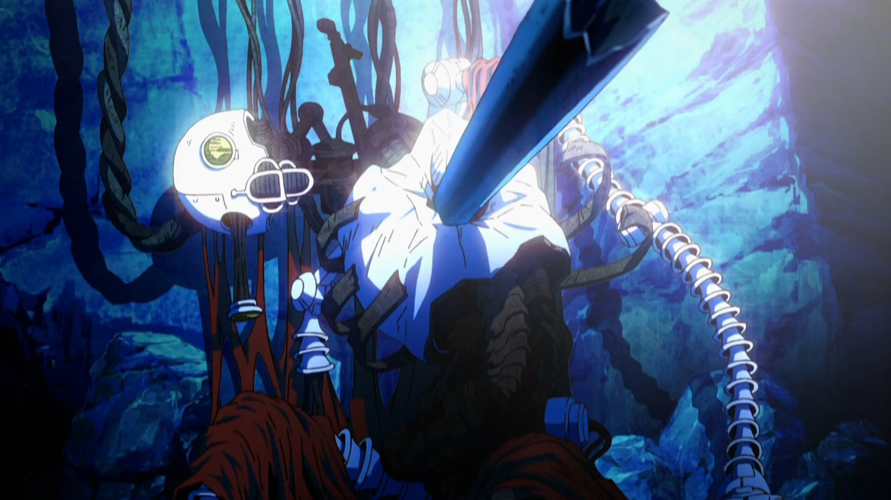
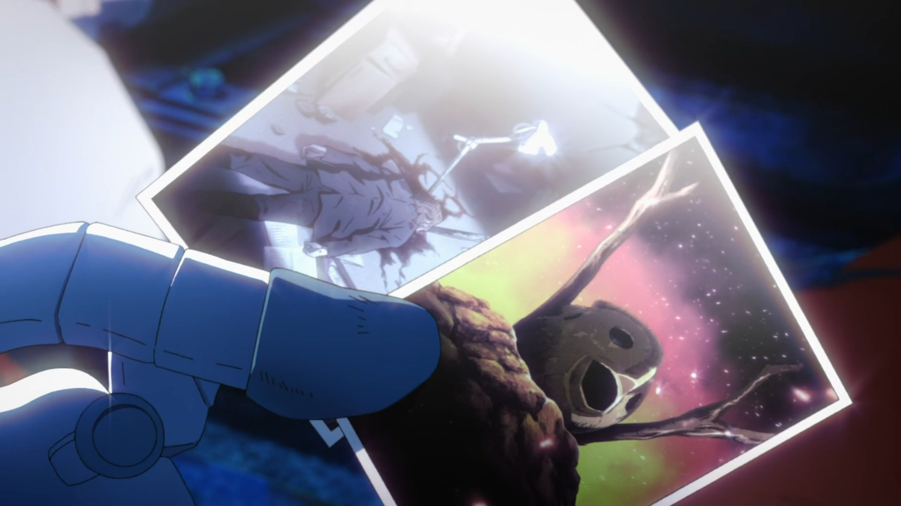

This is a short essay on the first episode of the Pluto (2023) anime.

First, I'll present evidence for the robot Brau1589 being an allusion to the Titan Prometheus from Greek mythology. Then, I'll discuss my thoughts on what "fire" Brau1589 may have stolen from the gods, who the "gods" may be and who Brau1589 may have given the "fire" to. Finally, I'll present some open questions that this allusion raises.

<!--more-->

*--- Spoiler Warning ---*

*--- Spoiler Warning ---*

*--- Spoiler Warning ---*

*--- Spoiler Warning ---*

*--- Spoiler Warning ---*

Investigating a pair of murders (a human and a robot) who's culprit may be a human or a robot, the Europol detective Gesicht meets with the only robot to have ever killed a human, Brau1589 (Robot Model HRS0288), to question him about these recent murders.

Brau1589 is imprisoned, presumably indefinitely, for his impossible crime. He committed murder despite his Robot AI, like all others, being designed to prevent robots from killing humans. According to him, after his capture, humans confirmed that there was no "defect" found in his programming. 

Brau1589 lays trapped, splayed out with a spear piercing his midsection pinning him to a wall.

Brau1589 explains that all his captors would need to do to kill him would be to simply pull the spear out of him. Yet, they choose to keep him alive and isolated from the world outside of his cell. This is his punishment.

Brau1589's killing of a human marks him as an anomaly, but also something more.

Portrayed as he is, as well as his role in the story thus far, Brau1589 is clearly an allusion to the Titan Prometheus from Greek mythology.

As stated on Wikipedia, "In Greek mythology, Prometheus is a Titan responsible for creating or aiding humanity in its earliest days. He defied the Olympian gods by taking fire from them and giving it to humanity in the form of technology, knowledge and, more generally, civilization.[^1]"

Prometheus was punished for having gone against the wishes of the Olympian gods. He was pinned by the gods to a tree and cursed to have an eagle eat his, regenerating, liver every day for the rest of his immortal life for his actions. Interestingly, in ancient Greece, according to Wikipedia, "the liver was thought to be the seat of human emotions.[^1]"

I doubt that Brau1589 has anything like a liver inside of him but his ressemblace to Prometheus is uncanny.

This allusion to Prometheus becomes closer to a reference through Brau1589's words during his discussion with the detective Gesicht. The detective shows Brau1589 some photos of the crime scenes and asks him: "What do you think these horns mean?[^2]"

In reply, Brau1589 says that the horns remind him of the gods of death. Specifically, Herne the Hunter from William Shakespeare's 1597 play *The Merry Wives of Windsor*, Hades from Greek mythology and the eponymous Pluto from Roman mythology.

This explicit reference to mythology primes us as viewers to start thinking about these mythic references explicitly. With the Brau1589-Prometheus allusion being the most obvious one so far.

Brau1589 continues by spelling out his theory on who the next targets may be. The murdered (destroyed?) robot was Mont Blanc, a legendary robot "[built with] the best technologies the world had to offer[^2]" and "who can also be [a] weapon of mass destruction[^2]." Seven such robots were built, Mont Blanc and Brau1589 among them, Brau1589 believes that the rest of these robots will be targeted next, himself included.

Brau1589 and the other legendary robots being god-like in their powers, the allusion to Prometheus, also a god, becomes more and more obvious.

If Brau1589 is an allusion to Prometheus, then what "fire" did he take, who did he take it from and who did he give it to?

Interestingly, Brau1589 is both a god-like being and a robot; having been manufactured by, and ultimately being subservient to and punished by, humans.

Perhaps, the "fire" that Brau1589 took was the human capacity to kill, taken from the humans who created him and given to the rest of the robots of the world.

In being recognized as being the first robot to have killed a human, Brau1589 may be acting as a harbinger of this change rather than being the cause of it.

Either way, he is being punished just like Prometheus all the same.

Both the detective Gesicht and North No. 2 (another of the seven legendary robots) are plagued by persistent dreams. Robots don't kill humans and robots don't have dreams in the world of Pluto. Gesicht and North No. 2 seem to both be exceptions to this rule, at least with respect to their dreams.

Perhaps, the "fire" that Brau1589 took from humans and then gave to the rest of the robots was not the human capacity to kill but rather the human capacity to feel, and to dream.

---

Pluto is exactly the kind of media that I love; dense with latent meaning, ready to be discovered by those of us lucky enough to find it. So far, it's proven itself to be the opposite of the kind of media that I dislike more than anything, that is "tale[s] told by an idiot, full of sound and fury, signifying nothing.[^3]"

In this essay, I focused mostly on one character, Brau1589, who's featured in a single four minute long scene but there's so much more to think about.

For example:
- The mass media's portrayal of Mont Blanc as a hero who captured "many terrorist cells without any bloodshed[^2]" contrasted with our knowledge of North No. 2's killing of tens of thousands of his robot brethren in the same war, and forced to live the consequences of his actions in it. If robots can have PTSD then maybe they're more human than we think?
- As stated by the newscaster, this war they're referring to is the "39th Central Asian War[^2]". Wait up... There were 38 Central Asian Wars before this one? Ok... Shouldn't the real heroes be the humans and robots working to stop the 40th Central Asian War from happening instead of a "weapon of mass destruction[^2]" created, presumably, by geopolitical powers capable of stopping these wars yet choosing not to?
- Brau1589 is an allusion to Prometheus but could he perhaps be an inversion of him? His voice over and vibes are sus as hell. I doubt that we're supposed to take what he says at face value. Instead of being a god of "forethought and crafty counsel[^1]" like Prometheus, could Brau1589 be the opposite and be lying outright to Gesicht, leading him and us as viewers astray in our understanding of the mystery as presented thus far?
- If Brau1589 is an allusion to Prometheus, are the other legendary robots also allusions? I don't want anybody to get sued but North No. 2 looks a hell of a lot like Ultraman.
- Is Gesicht a legendary robot? He's having dreams just like North No. 2. Brau1589 greets Gesicht like so: "in terms of detective AI, you're the best there is[^2]". The professor who performs Gesicht's scheduled maintenance states that Gesicht's design is so human that he might be able to experience fatigue unlike most other robots. I doubt that most robotics professors are spending much of their valuable time performing scheduled maintenances on any old robot. What makes Gesicht special enough to warrant this kind of treatment?

And that's just me barely scratching the surface of the first episode of Pluto. Well, I can't wait to watch some more. Did I mention that the animation, the sound and the voice over are top-notch?

It's good.

[^1]: “Prometheus.” Wikipedia, Wikimedia Foundation, 20 Aug. 2025, en.wikipedia.org/wiki/Prometheus.
[^2]: “Episode 1.” Pluto, written by Heisuke Yamashita, season 1, episode 1, Tezuka Productions, 2023.
[^3]: Shakespeare, William. Macbeth. Edited by Ted Hughes, The Ecco Press, 1991.