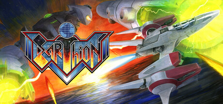
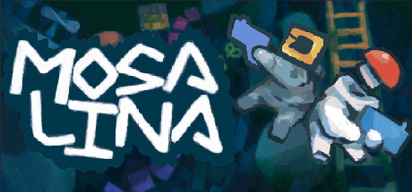
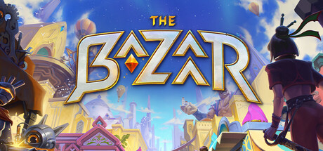
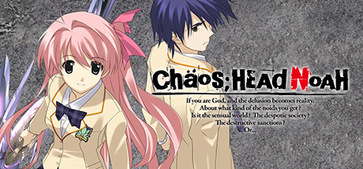

A list of **freak** games, in randomized order, released in 2025 that I played and enjoyed.

<!--more-->

This year I've decided to focus on highlighting **freak** games that most people haven't heard of because they're either too niche, too weird or both rather than games that everyone already knows about (if you're curious to see what didn't make my **freak** list, see the [honourable mentions](#honourable-mentions) below). 

# **Freak** GOTY List

## [Shiren the Wanderer: The Mystery Dungeon of Serpentcoil Island](https://store.steampowered.com/app/2178480/Shiren_the_Wanderer_The_Mystery_Dungeon_of_Serpentcoil_Island/)

The meaning of the word *roguelike* today is not what it once was, and that's fine. But this change that occurred sometime in the early 2010s forced members of the oldschool roguelike community to find another name for the games that they love that were actually like Rogue.

The name they landed on was **[traditional roguelike](https://www.roguebasin.com/index.php/What_a_roguelike_is)**.

Hypothetically, if one were to look up *traditional roguelike* in a hypothetical gamer dictionary, they would find the entry followed by a screenshot of Shiren the Wanderer: The Mystery Dungeon of Serpentcoil Island.

As a roguelike fundamentalist, I immediately fell in love with the latest entry in the Shiren the Wanderer series because it's a hyper-condensed embodiment of everything that traditional roguelikes are meant to be while being both welcoming to players new to the genre and providing just as much depth, if not more, than many of its peers.

Shiren the Wanderer: The Mystery Dungeon of Serpentcoil Island is a **freak** game because it's designed to be someone's first traditional roguelike and, yet, who in their right mind would decide to get into traditional roguelikes in 2025?

You tell me.

If you are a looking to become even **freakier**,


[Caves of Qud](https://store.steampowered.com/app/333640/Caves_of_Qud/) might also be a good place to start on your journey to learn to enjoy traditional roguelikes.

But keep in mind that Shiren and Caves of Qud are **very** different games, so you might like one but hate the other and vice-versa.


## [Deadeye Deepfake Simulacrum](https://store.steampowered.com/app/1545990/Deadeye_Deepfake_Simulacrum/)

Deadeye Deepfake Simulacrum is a *top-down action immersive sim* in which you play a little guy tasked with infiltrating high-tech secure facilities as a contractor for a company you don't know much about.

Depending on how you've decided to kit your guy out, you'll have access to a different set of game-changing abilities that will determine the options you'll have access to when tackling the many obstacles the game throws at you.

Deadeye Deepfake Simulacrum reminds me of a slowed down and much weirdier immersive sim-ified version of Hotline Miami in which you can hack a bullet so that it turns around mid-air and kills the person that fired it instead of you and that's why Deadeye Deepfake Simulacrum is a **freak** game.

## [Earthion](https://store.steampowered.com/app/3597580/Earthion/)

A Sega Genesis / Mega Drive *shmup* released in 2025 built to run on original hardware.

What differentiates Earthion from other "throwback"-style games is that if Earthion had come out in the late 80s or early 90s when games like this were being made for the Sega Genesis and systems like it, people would have *lost their fucking minds*.

Given how amazing Earthion is on every conceivable level (art, music, gameplay, you name it), if it had released back then I think it could have been responsible for reversing Sega's meteoric descent into obscurity and game publisher-dom.

If developing a Sega Genesis (which I'll remind you is a console that released in the year of our lord 1989) game in 2025 doesn't scream **freak** to you then I don't know what would.

## [Baby Steps](https://store.steampowered.com/app/1281040/Baby_Steps/)

Baby Steps is a *surreal physics-based open-zone 3D platformer* made by the developers of Ape Out and QWOP.

Baby Steps rejects extrinsic rewards entirely and instead encourages you to achieve mastery of its unconventional control scheme and, in doing so, gain the intrinsic reward tied to that feat of mastery of both mind and body.

Exploring Baby Steps's surreal world rewards you with cinematics often involving uncensored donkey dicks flopping around and for that reason alone, Baby Steps deserves to be considered a prime **freak** game.

## [Mosa Lina: Second Layer](https://store.steampowered.com/app/2477090/Mosa_Lina/)

Mosa Lina, the *bite-sized immersive sim platformer* that [I fell in love with in 2023](/blog/2024-07-01/#mosa-lina), received a massive free update in 2025 that doubled the number of tools, levels, bosses and music tracks in the game.

This combined with the coop mode that was added in 2024 firmly cements Mosa Lina as one of the greatest games of all time and one of the **freakiest** I've ever played.

## [Q-UP](https://store.steampowered.com/app/3730790/QUP/)

Made by the developer of Universal Paperclips, Q-UP is a *high-concept satirical multiplayer strategy idle-adjacent game* that tears down the often complained about topic of "balance" in matchmaking systems in games like DOTA and Overwatch.

Everything about Q-UP pops and results in an audio-visual experience that will tickle your rat brain in ways it's never been tickled before.

If you're anything like me, you'll get hooked by its addictiveness and by the time you finish the game you'll find yourself feeling a profound sense of emptiness, meaninglessness and shame for having wasted so much of your valuable time on this godforsaken Earth playing it.

And that's the point.

Unlike games like Vampire Survivors, Balatro, Megabonk, Deep Rock Galactic Survivor (I could go on, the rise of *gambling slop barely-games* continues), Q-UP raises its **freak** card proudly while holding your head such that you can't look away from the dark design elements present in it (intentionally so), perhaps in such a way that will allow you to be more aware of this kind of dark design present in other games.

## [The Bazaar](https://store.steampowered.com/app/1617400/The_Bazaar/)

The Bazaar is hard to describe succinctly because it's different enough from the games that came before it that referring to them isn't very helpful.

The Bazaar is an *asynchronous multiplayer roguelike autobattler deckbuilder* with Hearthstone aesthetics.

The boldness of the Bazaar's concept and its polish compared to the relatively few number of people who seem to know about it make the Bazaar an obvious contender for **freakiest** *asynchronous multiplayer roguelike autobattler deckbuilder* game of the year.

## [Eternal Strands](https://store.steampowered.com/app/1491410/Eternal_Strands/)

Eternal Strands is a *woke (non-derogatory) Monster Hunter-like* with an innovative and flexible magic system that made me feel like I had a really big brain when in reality my brain is regular-sized.

Eternal Strands was developed in Quebec (French Canada for the federalists and constitutional monarchists among you), the mecca of **freak** games that usually deserve to be a little more polished than they end up being on release day.

With that said, Eternal Strands might be the least **freaky** game on this list. Although any game with a well-written non-binary (trans?) autistic coded character that resonates with me deserves an honorary **freak** game designation, especially within the context of a gaming landscape where boring AF cookie cutter characters that bore me to death run rampant.

## [Atomfall](https://store.steampowered.com/app/801800/Atomfall/)

Atomfall is a *brit-core open-zone narrative-focused S.T.A.L.K.E.R.-like*.

As a S.T.A.L.K.E.R. mark, Atomfall's post apocalyptic [Roadside Picnic-esque](/books/9781613743416/) Zone setting combined with my love for Rebellion Developments's work on the Sniper Elite and Zombie Army games immediately hooked me.

Atomfall executes on its weird premise about as effectively as you can imagine.

I don't know who Atomfall was made for other than **freaks** like me and if that doesn't make Atomfall a **freak** game for **freaks** then I don't know what would.

## [The Hundred Line -Last Defense Academy-](https://store.steampowered.com/app/3014080/The_Hundred_Line_Last_Defense_Academy)

I've played half a dozen visual novels over the course of my gaming career, sinking hundreds of hours into this niche genre.

The Hundred Line -Last Defense Academy- is a *AA (AAA by visual novel standards) maximalist visual novel* developed as a collaboration between the two creators of the Zero Escape series and the Danganronpa series.

As someone who's enjoyed both of these series in the past, I spent the whole year trying to avoid this game because of the egregious number of hours required to beat it.

Eventually, the constant bombardment of recommendations thrown my way for this game combined with the renewed interest in visual novels I was afflicted with this year (see my [thoughts on CHAOS;HEAD NOAH below](#chaoshead-noah)) wore me down enough to get me pick it up and commit to seeing it all the way through.

All visual novels are **freak** games but The Hundred Line -Last Defense Academy- might be one of the **freakiest** ever made.

NB: I haven't beaten this one, far from it but I think it deserves the shout-out for its sheer audacity. I'm hoping it's well-executed but I'll get back to you sometime next year if it isn't.

# Honourable Mentions

## Normie Games that didn't make the **freak** list because they aren't **freaky** enough

I loved playing these games this year and if they weren't on everybody else's 2025 GOTY lists then they'd probably be on mine.

- [The Roottrees are Dead](https://store.steampowered.com/app/2754380/The_Roottrees_are_Dead/)
- [ARC Raiders](https://store.steampowered.com/app/1808500/ARC_Raiders/)
- [Clair Obscur: Expedition 33](https://store.steampowered.com/app/1903340/Clair_Obscur_Expedition_33/)
- [Blue Prince](https://store.steampowered.com/app/1569580/Blue_Prince/)
- [PEAK](https://store.steampowered.com/app/3527290/PEAK/)
- [Abiotic Factor](https://store.steampowered.com/app/427410/Abiotic_Factor/)

## **Freak** games that didn't make the cut

### [Sektori](https://store.steampowered.com/app/2105620/Sektori/)

One of the best, if not the best, *twin-stick* shooter ever made?

It's up there.

Although it's more of an **underrated niche** game than a **freak** game, but maybe I'm splitting hairs.

### [CHAOS;HEAD NOAH](https://store.steampowered.com/app/1961950/CHAOSHEAD_NOAH/)

I got back into visual novels this year and CHAOS;HEAD NOAH was the one I chose to spend more than 35 hours playing after hearing Mr. [Bassman](https://www.youtube.com/@bassman.reviews/videos) talk about it during a panel at my local anime convention, Otakuthon 2025.

I haven't played many visual novels because most of them don't seem like they would be worth playing (whether that's due to them being poorly written, being needlessly boring, being written for babies/man-babies, being relentlessly horny is besides the point).

CHAOS;HEAD NOAH feels like an exception to the rule. I wrote quite a bit of [spoilery notes on it here](/books/v22505/) if you're curious.

# Conclusion

2025 was a great year for both **freak** games and not **freak** games. In any other year many of my [honourable mentions](#honourable-mentions) would have been relatively **freaky** enough to make the **freak** list (did anyone say French JRPG?) but in a year as **freaky** as 2025 they didn't quite make the cut.

Here's hoping for 2026 to be just as if not more **freaky** than 2025.