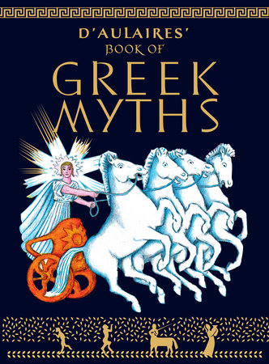

---
authors:
  - Robert Graves
books/tags:
  - mythography
  - reference
  - slay
date: 2021-12-01
params:
  isbn13: "9780241982358"
  year: "2018"
star_rating: 5
title: The Greek Myths
---

Robert Graves's The Greek Myths is more of an encyclopedia about everything related to the Greek myths rather than a pure retelling of the myths themselves. It's not meant to entertain, it's meant to inform. Although, if learning everything there is to know about Greek myths sounds entertaining to you then this is the book for you.

<!--more-->

I've always been fascinated by Greek mythology but my understanding of it came from the sanitized stories I read in D'Aulaires Book Of Greek Myths and secondhand from the many modern interpretations of the myths I had seen throughout my life.

Prior to reading this book, I had never really taken the time to dive deep into Greek mythology.

I'm glad I did because now I cringe thinking about all the times I said that I prefer Greek mythology to Christianity because it's: "way funner".

I mean, in some ways, it is buuuuuuut also Zeus rapes a lot (they don't really talk about that in d'Aulaires illustrated book for kids)...

If you want to learn about every single Greek myth that exists, then you should read this book. Otherwise, you should stay far far away from it.
