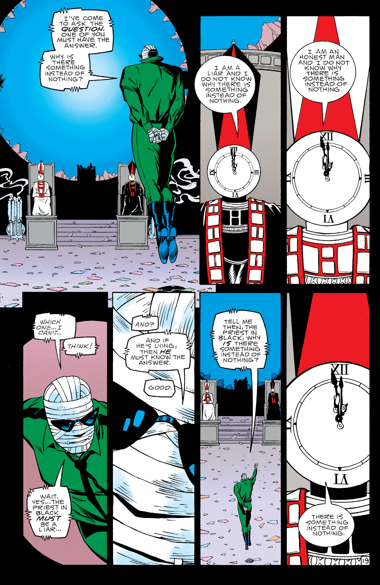
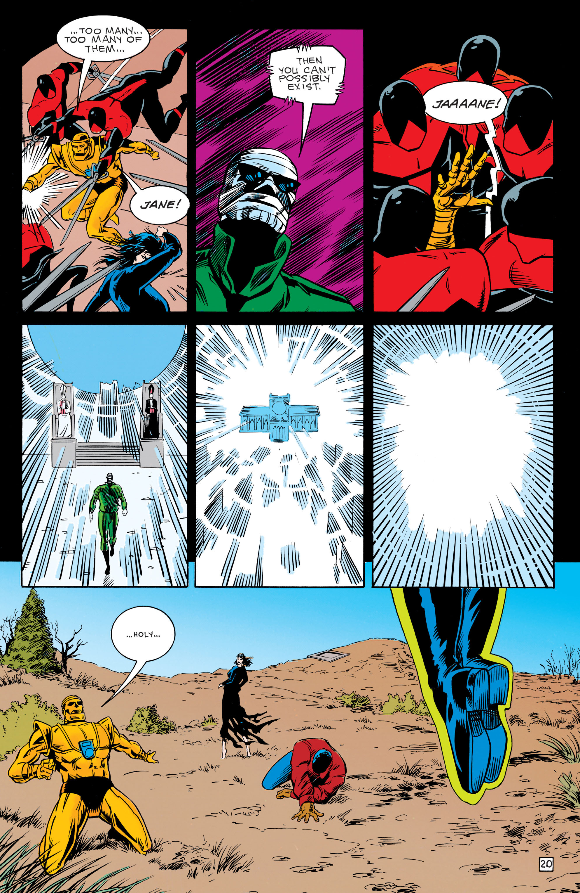

---
authors:
- Grant Morrison
books/tags:
- did-not-finish
- comics
date: 2024-08-12
params:
  isbn13: '9781401263126'
  year: '2016'
slug: '9781401263126'
star_rating: null
title: Doom Patrol
---

Grant Morrison's run of Doom Patrol focuses on the misfits, the weird and the broken and how they are fit to fight evils that other more conventional and sane heroes aren't equipped to deal with.

<!--more-->

Robotman has a fully mechanical body with his very human brain controlling new body. He can't feel anything. What makes a human a human if not for their ability to sense the world around them?

Crazy Jane is a woman with 64 different personalities, so far at least, each possessing a different power. She's unpredictable but it seems like her powers will come in handy time and time again. Who exactly is Crazy Jane? Who are they and what makes they, her?

Rebis is formed from the fusion of a man and a woman with the mind and bodies of both becoming one. Their memories are the memories of the two who became one but altered and corrupted in the process. When we change how does that effect us and does that effect others around us?

I've only read through 100 pages of this so far, covering the formation of the main team leading up to their handling of a problem involving a memetic fictional city (think Carcosa in the King in Yellow) that is taking over the real.

The newly formed Doom Patrol is forced to come together to stop this.

I'm loving it so far although the art is OK and some panels can a little 2edgy5me.

**Spoilers for the first 4 issues of Grant Morrison's Doom Patrol**

Let's talk about an example of this edgyness:

The Doom Patrol find themselves caught within the memetic fictional city of Orqwith that's the main culprit of the first 4 issues of the run.

We learn that this city was created by still living authors and philosophers who built a logical killswitch within it. When pulled, it will disrupt the internal logical consistency of Orqwith and thus destroy it.

Eventually Rebis flies over to the cathedral at the center of the city with two Zen Koan-esque pope figures, one who lies and the other only tells the truth. 

Rebis then engages in logical debate with these two logic popes and eventually triggering their killswitch. 

Reading these pages, I could hear the sound of vuvuzelas blasting and see Rebis taking off only to put his dark shades back on while the cathedral blows up behind him in slow motion.

It's not edgy exactly. I'm not sure what it is exactly. It feels a little tropey, maybe comic booky?

Moments like this, big theoretically awesome panels, are spread throughout the Incal as well but the ones in Doom Patrol aren't hitting as hard or as smoothly as the ones in the Incal for some reason.

TBD