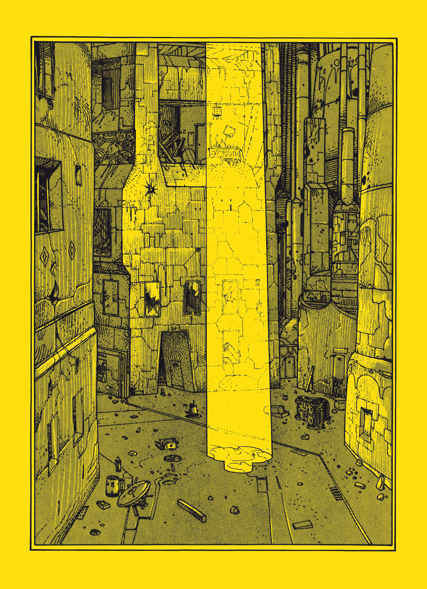

---
authors:
- Alejandro Jodorowsky
- Moebius
books/tags:
- comics
date: 2024-08-14
params:
  isbn13: '9781594650420'
  year: '2013'
slug: '9781594650420'
star_rating: 3
title: The Eyes Of The Cat
---


Whenever he [Moebius] finished a page, he would call me on the telephone. Driven by an irresistible curiosity, I would immediately get in my car to go see him. Every time I saw a new page, I swear on the life of my cat Kazan that I experienced a spiritual pleasure exceeding that of an orgasm. There before my eyes, I had the undeniable proof that comic book art was great art, just as respectable as the paintings hanging on the walls of museums.


--- Alejandro Jodorowsky, July 29, 2011 

<!--more-->

Seems like Jodorowsky and Moebius's first attempt at their style of comic they'd try again with [Angel Claws](/books/9781594650123) years later. The left page has some text and a recurring less detailed drawing combined with a more detailed drawing on the right page of each fold. One of Moebius's earliest works, the Horny Goof also makes use of this. It seems like a style that he will keep coming back to. The degree of connection, thematically or otherwise, between the left and right page drawings varies between these attempts.

I like The Eyes of the Cat way more because Moebius's art in this is so detailed and evocative. After reading this I understand what people seem to like about Moebius black/white drawings.



