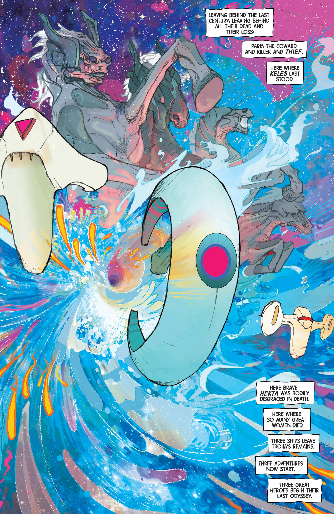

---
authors:
- Matt Fraction
- Christian Ward
books/tags:
- did-not-finish
- comics
- myth
- science fiction
date: 2024-08-14
params:
  isbn13: '9781632159274'
  year: '2016'
slug: '9781632159274'
star_rating: null
title: ODY-C
---

Gender-swapped psychedelic sci-fi comic book version of Homer's Odyssey?

Sounds crazy. I'm into it.

<!--more-->

The writing is odd. The choice to retain poetic-sounding language with rhymes is a bold one because speech bubbles and their placement prevents the reader from being able to read the lines in the precise manner required to fully appreciate the alliteration and the rhymes of the poetry.

The art is fantastic, it's psychedelic, wavy and colourful. It provides a solid lens through which to really see this sci-fi universe for what it is: one that is malleable, in flux and always being altered by the whims of the Olympian Gods.





The choice to interweave the Epic of Gilgamesh into the story as well is kind of wild. Especially framing the story as read by He, the gimp (Helen?) of Odysseus.