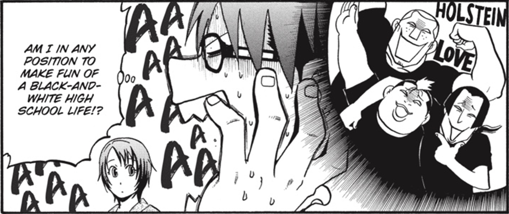
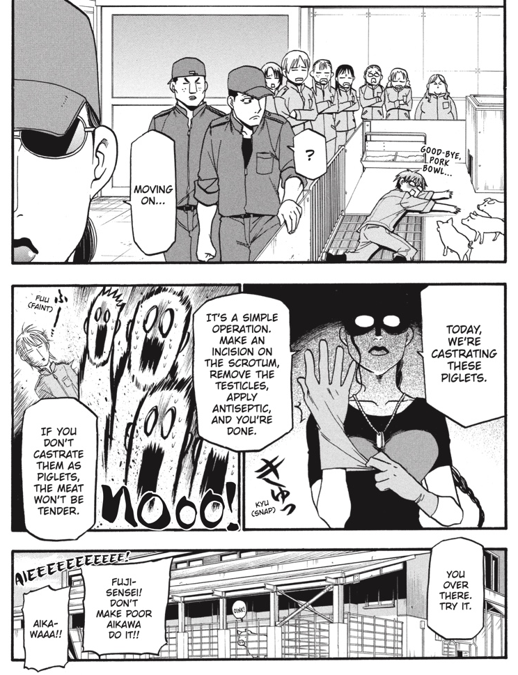
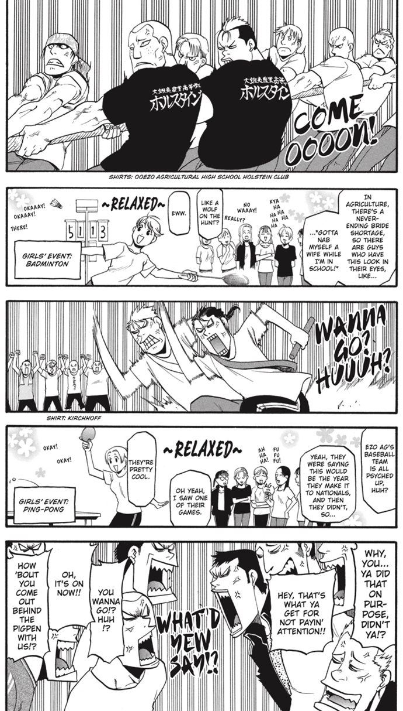
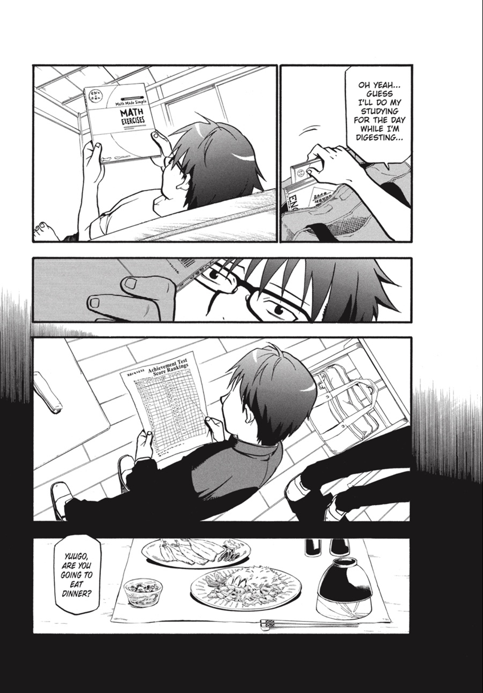

---
authors:
- Hiromu Arakawa
books/tags:
- comics
date: 2025-09-05
params:
  isbn13: '9781975310042'
  year: '2018'
slug: '9781975310042'
star_rating: 4
title: Silver Spoon
---

<!--more-->

Silver Spoon is:
- A manga by Hiromu Arakawa (known for her work on Full Metal Alchemist) with an especially amazing first half. It's an absolute masterclass in writing/drawing manga that goes way beyond just providing you with a drip-feed of cheap thrills like a lot of manga does. It's followed by a less stellar second half, the story slows down in a big way, there's very little conflict to push the story forward. I would have preferred for Arakawa to spend more time zooming in on Hachiken's classmates struggles, like we did for him in the first half of the series, rather than continuing the story with a "becoming a small business owner" arc.
- A big tear jerker but in a genuine way. There's very little melodrama. The drawings are used masterfully in combination with the words on the page to bring the characters's thoughts and emotions to life. 
- Thematically:
  - about meaning---the struggle to find it in your life.
  - about trauma---recognizing its lasting consequences on you and its impact on your behaviour and what to do about it.
  - about community---leaning on it when you need to and contributing to it for the good of everyone.
  - about privilege---not taking it for granted and leveraging it to help make the world a better place.
- Filled with Buddhist themes.
- A manga serialized from April 2011 to November 2019. Over the course of 8 years, it shouldn't be surprising that the manga itself changed as the people making it changed and the world changed around them. Serialization will always come at the expense of consistency (style, thematic cohesiveness, etc)---the degree to which this impacts a serialized work like this is something I'm always looking at. There's great moments all throughout Silver Spoon but they're much more densely packed in the first half of the series. There's a moment about halfway through the series where it feels like the team behind the manga ran out of good ideas, were unable to start closing loops (letting the guy and girl get together, etc.) and so, started padding out arcs without imbuing them with the love and care that was clearly packed into the rest of the series up until this point.

Here's a few cool pages/panels from the first two volumes (nothing too spoilery):

_Arakawa filling a single panel with Hachiken's thinking about three other characters, his verbal and non-verbal reactions to these thoughts and Mikage's reaction to his reaction. Man, she's efficiently using this space!_

_Arakawa's breathing so much life onto the page by combining prose and visual arts in a way that you wouldn't be able to achieve with either medium on its own. Also, contrasting Aikawa, the squeamish veteranian hopeful, with the rest of the students here is a nice touch._

_Arakawa cutting back-and-forth between the boys and the girls as each of them compete in a friendly (or not so friendly) physical competition._

_Arakawa's amazing use of a black gradient escaping from the panels onto the page itself---representing Hachiken being overwhelmed by the trauma from his past._
