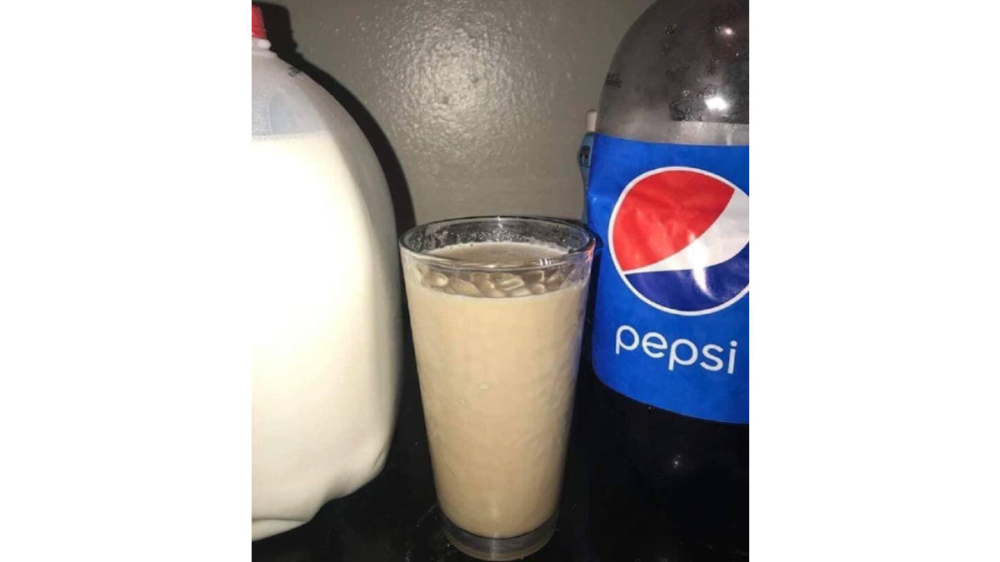

If you're reading this heartfelt message, it is because you are a curious individual looking for answers.

Why are we here?

What's the meaning of life?

Is there a God?

Any and all questions you've ever asked yourself can be answered with one simple word. It is a word that describes a way of living that will allow you to transcend from your human husk and become one with the universe.

 _Pilk_

Ashes to ashes, Pilk to Pilk. Just as gold is purified in the fire, so the soul is purified in the Pilk.

Let no man join us who is afraid, and we want none but those who are saved, sanctified and aflame with the fire of the Pilk.

We are the Pilkers, our reverance towards the Pilk brings us ever closer to immortality.

All those who stand in defiance towards us will be consumed by the Pilk. Until all those who remain on Earth rightfully worship the Pilk, in its many forms.

You shall bow down in reverence to the Pilk. The perfectly balanced ratio of one part Pepsi, one part milk must be ingested daily while reciting the following mantra thrice:

"I believe in the power of the Pilk that believes in me."

"I believe in the power of the Pilk that believes in me."

"I believe in the power of the Pilk that believes in me."

Us Pilkers have been congregating in the shadows since before the dawn of time. Awaiting for our moment to reveal ourselves to the world and begin our benevolent conquest of the human race.

The time is now.

Join us in our quest to achieve immortality and spread the gospel of the Pilk across the Earth and, eventually, across the universe.

I am but a mouthpiece for the Pilk. Yet, I cannot fully convey the power of the Pilk through words alone. You must ingest the Pilk to even start to begin to understand what the Pilk can do for you, and what you can do for the Pilk.

Join us now of your own volition or join us when the Sea of Infinite Pilk found in the Milky Way begins Pilkening and expands ever outwards, consuming us all. It's your choice.

### FAQ

_How did I become the speaker for the Pilk?_

I was shown a vision across time and space of the Original Pilker. In his hand, he held the Original Pilk.

He spoke to me and me alone.

"Pilk. One part Pepsi, One part milk. Worship this brew... I think drinking Pilk halved my IQ."

 
 
 
 
 
 
 
 
 
